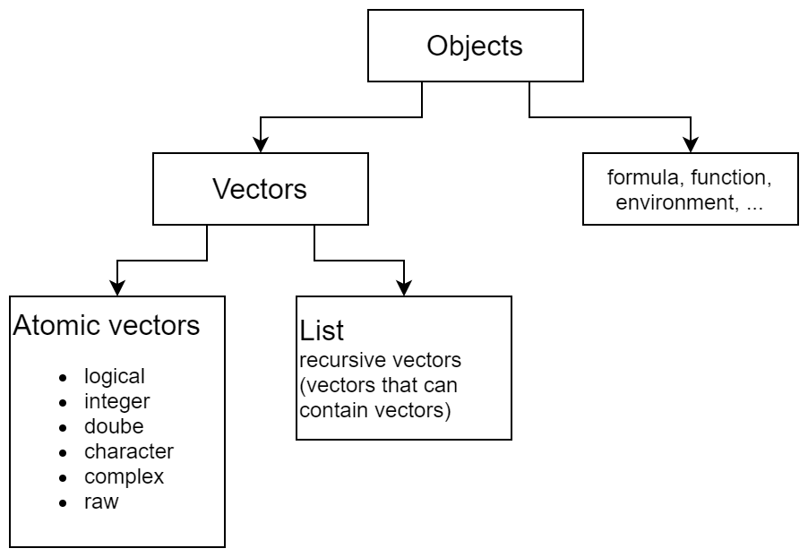
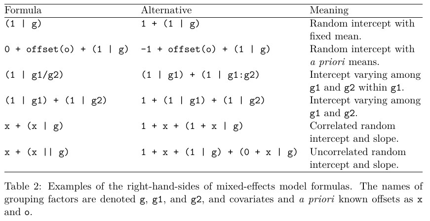

# (PART) R Language {-} 

# Objects

> To understand computations in R, two slogans are helpful:
>
> * Everything that exists is an object.
> * Everything that happens is a function call.
>
> --- John Chambers


## Inspect object
* `str()`: struction of object, get unsystematic overview
* `typeof()`: "low-level" type of an object
* `mode()`: storage mode of an object
    - Determines how an object is stored
* `class()`: "high-level" class of object
    - Determines what method is applied when passed to generic functions

`typeof()` and `mode()` are almost the same (at the same level) except that they use different names

| `typeof()`      | `mode()`           |
|:----------------|:-------------------|
|`integer`, `double`|`numeric`         |
|`special`, `builtin`|`function`       |
|`symbol`         |`name`              | 
|`language`       |`(`, `call`         |

`class()` is on a complete different level and determines what method is applied when passed to generic functions. Some classes are explicitly stated as an attribute, others are implicitly given by the `mode`

For historical reasons (back compatibility with S / S+), another low-level inspector function is `storage.mode()`.


```{r, echo = FALSE}
mystrings <- list("1", "1:2", "pi", "1i", "NA", "c('A', 'b', ':::')",
              "mean", "c", "`function`", "as.name('Mä')", "quote(x)",
              "quote(`{`)", "expression(1+1)", "call('round',10)", "quote(sin(x))",
              "y ~ x+t", "formals(lm)", "formals(lm)[[1]]", "NULL")
myexpr <- lapply(mystrings, str2expression)
myobj <- lapply(myexpr, eval)
myprint <- function(x, max.length= 1000L) {
  r <- tryCatch(format(x), error=function(e)e)
  r <- if(inherits(r, "error"))
    tryCatch(as.character(x), error=function(e)e)
  else paste(r, collapse = " ")
  r <- if(inherits(r, "error"))
    tryCatch(capture.output(x), error=function(e)e)
  else paste(r, collapse = " ")
  substr(r, 1L, max.length)
}
mytab <- cbind(expr = mystrings,
               object = sapply(myobj, myprint, max.length = 16),
      typeof  = sapply(myobj, typeof),
      storage.mode = sapply(myobj, storage.mode),
      mode    = sapply(myobj, mode),
      class   = sapply(myobj, class))
knitr::kable(mytab, format="pandoc")
```


## Classifications

Objects can be ordered in a hirarchical structure

```{r, echo = FALSE, out.width='50%'}

```

* Vector
    - Atomic vector
        + Matrix
        + Array
    - List
        + Data frame
* Function
    - Primitive
    - Closure
* Environment
* Symbol
* Call
* Expression
* Forumla
* ...

Some objects are building blocks for other objects

* Symbols can be combined to calls.
* Calls can be combined to expressions


## Basic Objects

### Vectors, functions and environments
Vectors will be covered in chapter \@ref(vec), functions in  chapter \@ref(fun) and environments in chapter \@ref(env)


### Symbols
* A way to refer to R objects by name
* Constituent of calls
* Type: symbol
* Class: name

```{r}
x <- call("sin", 1:3)
typeof(x[[1]])
```


### Calls
* An unevaluated expression which consists of the named function applied to the given arguments
* Class: call
* Type: language
* Evaluate a call with `eval()`

| Action      | R command                            |
|:------------|:-------------------------------------|
| Create      | `call()` or `quote()`|
| Check       | `is.call()`                          |
| Coerce      | `as.call()`                          |

```{r}
x <- call("sin", 1:3)
y <- quote(sin(1:3))
eval(x)
```


### Expression
* Lists of calls
* `expression()` returns its arguments as a vector of unevaluated expressions.
* `quote()` returns its argument as an unevaluated expression.
* `eval()` evaluates an expression in a certain environment

```{r}
eval(quote(mean(c(1:3))))
```

#### Evaluate strings as variable names {-}
```{r, collapse=TRUE}
a <- 1.34
get("a")  # returns object
eval(parse(text = "a"))  # eval: evaluates an expression, parse: convert string to expression
```


### Formulas

[Helppage](https://stat.ethz.ch/R-manual/R-devel/library/stats/html/formula.html), [Tutorial](https://www.datacamp.com/community/tutorials/r-formula-tutorial)


* Formulas contain a `~` and at least one predictor variable
* Formulas are
    - unevaluated expressions
    - attributes
        + class `formula`
        + environment
* The additional environment attribute is what separates them from expressions
    - makes sure that terms in formula can later be associated with vectors of values.

```{r, collapse=TRUE}
form1 <- ~x
class(form1)
attributes(form1)
length(form1)

form2 <- y ~ x + I(x^2) + x:z
class(form2)
length(form2)
form2[[1]]
form2[[2]]
form2[[3]]
```

| Action      | R command                            |
|:------------|:-------------------------------------|
| Create      | `formula()` or just type it (automatically detected based on `~`)|
| Check       | `plyr::is.formula()`                 |
| Coerce      | `as.formula()`                       |


Functions to inspect/change formulas

* `terms()`
* `all.vars()`
* `update()`


Formula syntax is a way to specify linear models.

* `y ~ model`: response y is modeled by linear predictor
* `model` consists of terms separated by `+`
* Single terms consist of variable/factor names separated by `:`
* Such a term is interpreted as the interaction of all the variables and factors appearing in the term.


|Symbol  |  Example  |  Meaning                                                 |
|:-------|:----------|:---------------------------------------------------------|
|`~`     |`Y ~ X`    | Y is response variable, X is predictor|
|`+`     |`+ X`      | Add X to linear predictor|
|`-`     |`- X`      | Remove X from linear predictor|
|`:`     |`X:Z`      | Interaction between X and Z|
|`*`     |`X*Y`      | X + Y + X:Y |
|`^`     |`(X+Y+Z)^3`| All terms and all interaction up to tree way interaction|
|`|`     |`X|Z`      | conditioning: X given Z|
|`I`     |`I(X*Z)`   | as is (escape formula meaning of `*`), product of X and Z|
|`log()` |`log(X)`   | log(X), not necessary to escape because `log()` has no special formula interpretation|
|`1`     |`X - 1`    | Intercept: remove intercept which is automatically included|
|`/`     |`X/Z`      | X + X:Z  (Z as nested factor in X)|
|`%in%`  |`Z %in% X` | X:Z (Z as nested factor in X, internally gets transformed to `:`, usually use upper notation because main X effect should also be included)|
|`poly()`|`poly(x,2)`| Orthogonal polynomials up to degree 2|
|`Error()`|`Error(X)`| Additional error term determined by factor X|
|`.`     |`Y ~ .`    | Two interpretations. 1) Model fitting: all columns not otherwise in the formula, 2) `update.formula()`: what was previously in this part of the formula|


Special cases in `lme4`:

`(1 | batch/cask)` is equivalent to `(1 | batch) + (1 | batch:cask)`

```{r, echo = FALSE, out.width='75%', fig.align='center', fig.cap='lme4 formula syntax. From Bates et al. 2015'}

```


Check if formula constructs your expected model with `model.matrix()`

```{block2, type='rmdcaution'}
`y ~ (x1 + x2)^3` does not make sense. 3-Way interactions are only possible between at least 3 variables.
```

Update formulas with the `update()` function

```{r, eval=FALSE}
fit2 <- update(fit, .~. + X2)
```


Formula examples:

```r
Yield ~ Genotype*Nitrogen + Error(Block)
# Effect and interaction of Genotype and Nitrogen
# Block effect as random effect

y ~ .^2
# all remaining columns with all possible 2 ways interactions
```


### Not understand yet
* `parse()`
* `all.equal()`


Why?
```{r}
x <- call("sin", 1:10)
y <- quote(sin(1:10))
identical(x,y)
```

