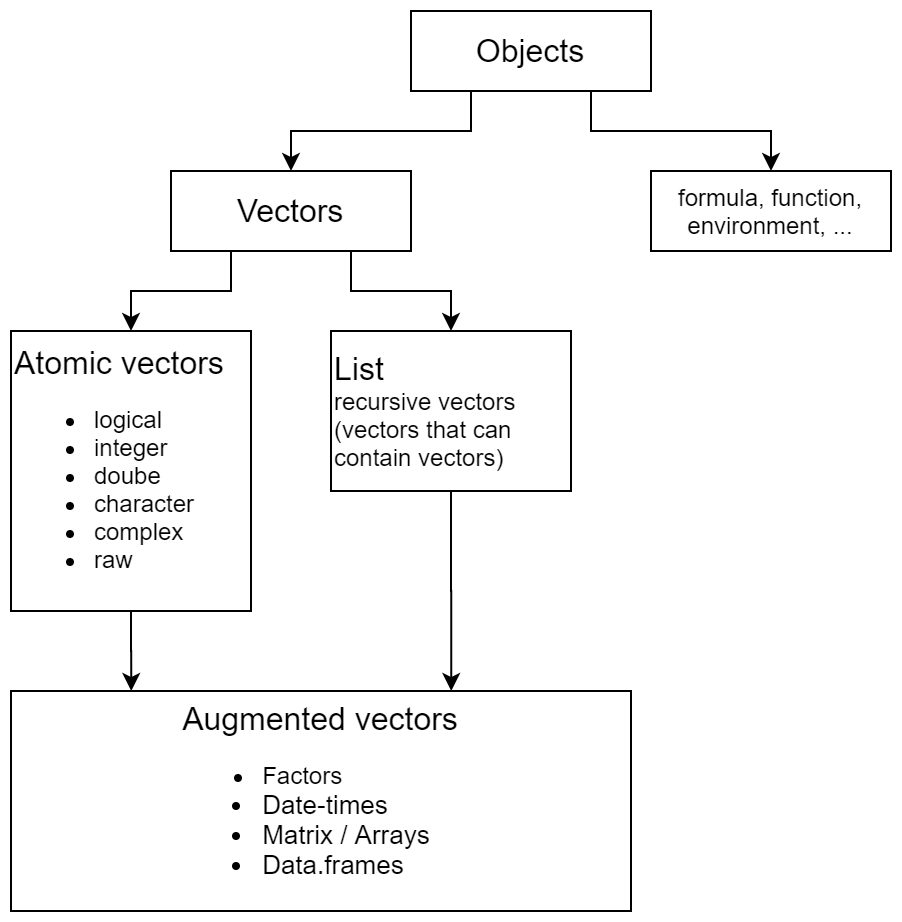
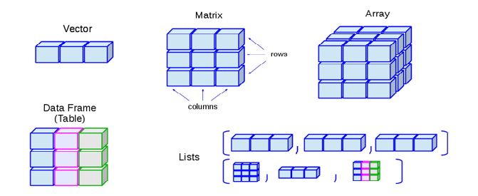

# Vectors {#vec}


```{r, echo = FALSE, out.width='50%', fig.show='hold', fig.align='default'}

knitr::include_graphics('figures/data-structures-overview.png')

```


vector_types.png

Almost all data in R is stored in vectors. Most famous vector types are listed below

|Vectors        |Description                                        |
|:--------------|:--------------------------------------------------|
|Atomic vector  |1 dimensional collection, homogeneous, flat        |
|List           |1 dimensional collection, heterogeneous, recursive |
|Matrix         |Atomic vector 2 dimensions                         |
|Array          |Atomic vector n dimensions                         |
|Data frame     |List containing atomic vectors of same length      |

**homogeneous:** only contains one data type
**flat:** no nested structure (vector containing another vector)
**recursive:** nesting is possible


All vectores can be described using 4 properties

|Property                  | Explanation                         | Example `x <- 1:3`|
|:-------------------------|:------------------------------------|------------------:|
|Content                   | Information stored in the vector    |            `1 2 3`|
|[Type](#type)             | Data type (numeric, list, ...)      |          `integer`|
|[Length](#length)         | Lenght of the vector                |                  3|
|[Attributes](#attributes) | Additional properties of the vector |             `NULL`|


## Type {#type}

### Atomic

Within atomic vectors there are 6 vector types

* Logical  (`TRUE`)
* Integer  (`1L`)
* Double   (`3.14`)
* Character (`"Hello"`)
* Complex  (`2+5i`)
* Raw      (`48 65 6c 6c 6f` bits)

```{block2, type='rmdcaution'}
By default numbers are of type double. If you really want integers put `L` at end e.g. `typeof(1)` vs `typeof(1L)`.
```


| Action      | R command                  |
|:------------|:-----------------------------------------------------------|
| Create      | Create a vector with `c()`. The output of function `c()` is of a certain type. The type is determined by the following hierarchy (so called coercian = "Zwang") <br> NULL < raw < logical < integer < double < complex < character < list < expression|
| Check       | `typeof()` or with `is.character()`, `is.double()`, `is.integer()`, `is.logical()` and more generally `is.atomic()`|
| Coerce      | `as.character()`, `as.double()`, `as.integer()` or `as.logical()`|


### List

| Action      | R command                            |
|:------------|:-------------------------------------|
| Create      | Creat a list with `list()` or connect existing lists with `c()`|
| Check       | `is.list()`                          |
| Coerce      | `as.list()`                          |
| Unlist      | Make atomic vector out of list: `unlist()` |

##### Subsetting lists

* `[` extracts a sub-list, the result will always be a list
* `[[` extracts a single component from a list
* `$` is shorthand for extracting named elements of a list


### Check type of vector

* `typeof()`
* `is_*()`

|                  | lgl | int | dbl | chr | list |
|------------------|-----|-----|-----|-----|------|
| `is_logical()`   |  x  |     |     |     |      |
| `is_integer()`   |     |  x  |     |     |      |
| `is_double()`    |     |     |  x  |     |      |
| `is_numeric()`   |     |  x  |  x  |     |      |
| `is_character()` |     |     |     |  x  |      |
| `is_atomic()`    |  x  |  x  |  x  |  x  |      |
| `is_list()`      |     |     |     |     |  x   |
| `is_vector()`    |  x  |  x  |  x  |  x  |  x   |


## Length {#length}

`length()` or generalization for higher dimensional vectors (`nrow()`,`ncol()`,`dim()`)

## Attributes {#attributes}

* named list
* metadata about objects
* access all with `attributes()`
* set several attributes with `structure()`
* access, set and change single attribute with `attr()`

```{r}
x <- 1:3; names(x) <- c("a", "b", "c")
x
attributes(x)
```

Set and change them with

* All at once
    - `structure()`
* Specific ones
    - `names()` / `unname()`
    - `dim()`
    - `class()`

```{r}
x <- structure(1:10, names=letters[1:10], foo="bar", class="myclass")
x
```


Three attributes  are **not** lost when object is modified

* Names: names of entries in vector
* Dimensions: define matrix and arrays
* Class: (e.g. numeric, data.frame, function, ... implement S3 object system)


## Factors {#vec-factors}

Factors

* Atomic vectors
* Type: integer
* Class: factor
* Additional attribute: levels

```{r}
x <- as.factor(1:4)
attributes(x)
```

| Action      | R command                            |
|:------------|:-------------------------------------|
| Create      | `factor()`                           |
| Check       | `is.factor()`                        |
| Coerce      | `as.factor()`                        |

Access set and rename levels with `levels()`


## Matrices/Arrays


Adding dimensions to an atomic vector automatically changes it to an Matrix/Array

* Class: Matrix/Array (but not shown in attributes)
* Additional attribute: dim

| Action      | R command                            |
|:------------|:-------------------------------------|
| Create      | `matrix()`, `array()`                |
| Check       | `is.matrix()`, `is.array()`          |
| Coerce      | `as.matrix()`, `as.array()`          |

Access, set and change dimensions with `dim()`


Higher dimensional generalization of `length()`, `names()` and `c()`

|1 dim      | 2 dim                     | n dim       |
|:----------|:--------------------------|:------------|
|`length()` |`nrow()`, `ncol()`         | `dim()`     |
|`names()`  |`rownames()`, `colnames()` |`dimnames()` |
|`c()`      |`rbind()`, `cbind()`       |`abind()`    |


## Data frames

* Type: list
* Class: data.frame
* Additional attribute: `names`, `row.names` and `class`

| Action      | R command                            |
|:------------|:-------------------------------------|
| Create      | `data.frame()`                       |
| Check       | `is.data.frame()`                    |
| Coerce      | `as.data.frame()`                    |

Data frame columns can also contain lists and matrices, but it is better to use lists for this purpose.


## Special values

|                  |  0  | Inf | NA  | NaN |
|------------------|-----|-----|-----|-----|
| `is.finite()`    |  x  |     |     |     |
| `is.infinite()`  |     |  x  |     |     |
| `is.na()`        |     |     |  x  |  x  |
| `is.nan()`       |     |     |     |  x  |


### Missing values

Different types of `NA`

* `NA_real_` (double)
* `NA_integer_`
* `NA_character_`
