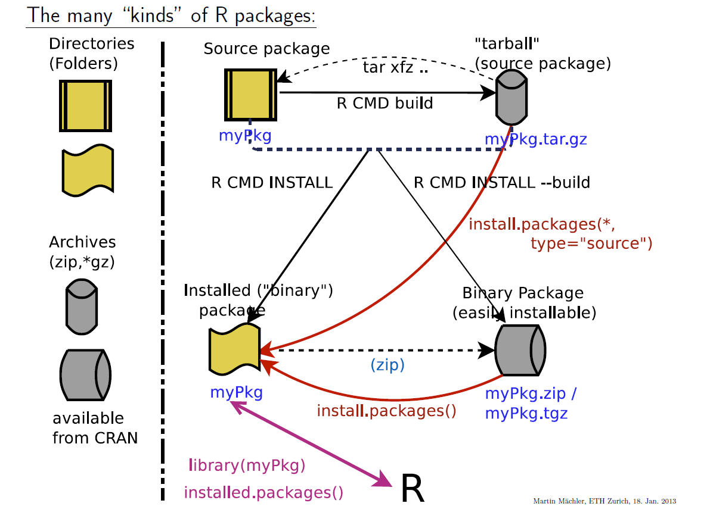

# Miscellaneous

## How does R save numbers

Top question in the [FAQ page](https://cran.r-project.org/doc/FAQ/R-FAQ.html) of CRAN: 7.31 Why doesn’t R think these numbers are equal?

Strange example:
```{r}
x1 <- seq(0, 1, by = 0.1)
x2 <- 0:10 / 10
x1 == x2
```

The numbers are not equal even if they are printed the same way by default.
We find the true values if we print more number of digits

```{r}
print(x1, digits = 17)
print(x2, digits = 17)
```

The saved numbers are not precisely the number we would expect. There are two reasons for that:

1. Rounding to store decimal numbers
2. Binary representation of decimal numbers

##### Rounding decimal numbers {-}

Storing a decimal numbers (double) with infinite precision uses an infinite amount of memory. Therefore doubles are rounded before they are stored to the computer:

```{r}
x <- 1/3
print(x, digits = 22)
```

only 17 digits after the comma are stored when calculating 1/3

##### Binary representations {-}

But why was it not possible to store 1/10 precicely even as it has only one digit after the comma? Computers use binary representations to store data. If we write 0.1 in binary representation it has infinite decimal places (see [here](https://www.exploringbinary.com/why-0-point-1-does-not-exist-in-floating-point/)). Therefore the number has to be rounded and is no longer precise.

Numbers with finite decimal places in binary are fraction of $m / n$ with $n$ in the form $n = 2^k, k \in \{0,1,\dots\}$

Examples:

* finite decimal places in binary:  1/2,  3/4,  13/16
* infinite decimal places in binary: 1/10, 2/10, 3/10, 4/10


### How to avoid problems with doubles

1. Do not use '==' for numbers unless they are integer (or otherwise *known* to be exact)
2. Compare (vectors of) numbers with `all.equal()`

```{r, collapse=TRUE}
all.equal(x1, x2)
all.equal(x1, x2, tol = 1e-10)
all.equal(x1, x2, tol = 0) ## -> shows the *relative* difference
abs(x1 - x2) <= 1e-10 * abs((x1 + x2)/2) # alternatively
```

### More interesting information about double representation

Many double representation properties depend on the platform (often 64-bit)
help page of `.Machine`

```{r table2, echo=FALSE, message=FALSE, warnings=FALSE, results='asis'}
tabl <- "
|Element |Explanation                                        |Typical Value | In binary   |
|--------|---------------------------------------------------|-------------:|------------:|
|double.epsilon | smallest number you can add such that `1 + x != 1`|2.220446e-16 |`2^-52`|
|double.xmin    | smallest possible floating point           |2.225074e-308 |`2^-1022`    |
|double.max.exp | largest exponent possible for double       |1024          |`2^10`       |
|integer.max    | largest possible integer                   |2147483647    |`2^31`       |
|and more       | ...                                        |              |             |
"
cat(tabl)
```

Note that you can store much larger numbers with double than with integers. Numbers larger than the largest double are stored as `Inf`

```{r, collapse=TRUE}
2147483647L + 1L
2^1023.9999
2^1024
```


## How packages can exist

(ref:MiscPack) Four formes how a package can be saved (upper: source, lower: binary)

```{r MiscPack, echo = FALSE, fig.cap='(ref:MiscPack)', fig.show = 'hold'}

```
