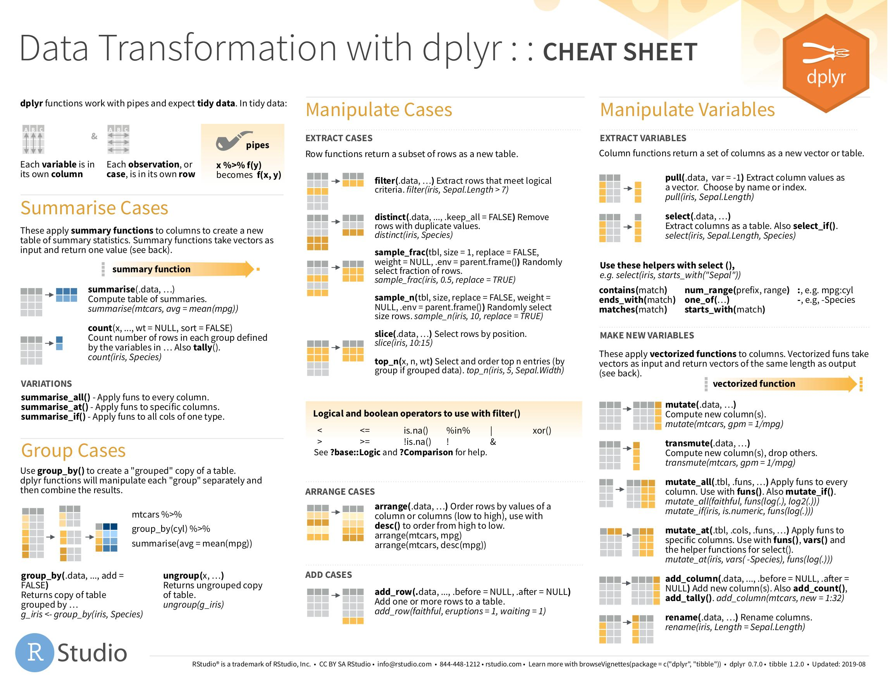

# Data handling

## Atomic vectors


### Basic operations

|  | Arithmetic |   | Comparison |   | Logical |
|:-|:-----------|:--|:-----------|:--|:--------|
|`+`| Addition | `<` | less than | `!x` | logical NOT |
|`-`| Subtraction | `>` | greater than | `x & y` | logical AND (vectorized)|
|`*`| Multiplication | `<=` | less or equal | `x && y` | logical AND (single value)
|`/`| Division | `>=` | greater or equal | `x | y` | logical OR (vectorized) |
|`^`| Power of | `==` | equal | `x || y` | logical OR (single value) |
|`%%`| Modulo | `!=` | unequal | `xor(x,y)` | logical exclusive OR |
|`%/%`| Integer division | | | | |

Order in which they are executed is defined in `?Syntax`

##### Examples {-}

```{r, collapse=TRUE}
7 %% 2    # remainder
7 %/% 2   # floor of division
```

```{r, echo = FALSE, fig.cap='...'}
knitr::include_graphics('figures/logic_gates.png')
```


### Factors

Also see chapter \@ref(vec-factors)

* `levels()` print or overwrite labels of factor levels
* `relevel()` The levels of a factor are re-ordered so that the level specified by `ref` is first and the others are moved down.
* `reorder()` Reorder the factor levels according to another variable

```{r, out.width='50%'}
# Make level B the first level (reference value)
InsectSprays$spray <- relevel(InsectSprays$spray, ref = "B")

# Reorder levels of spray by median of count (first class should have lowest count median)
InsectSprays$spray <- reorder(InsectSprays$spray, InsectSprays$count, FUN = median)
boxplot(count ~ spray, data = InsectSprays)
```


##### forcats package {-}

<a href="figures/03_pdf/factors.pdf" target="_blank"> 
```{r, echo=FALSE, out.width='50%'}
knitr::include_graphics('figures/03_pdf/factors.jpg')
```
</a>


* `fct_reorder()`  Reorder the factor levels according to another variable
* `fct_reorder2()`  Reorder the factors according to last value of x axis
* `fct_inorder()`  Reorder factors levels by first appearance or frequency
* `fct_relevel()`  Set a certain level first or last (or at certain position)
* `fct_infreq()`  Reorder levels by the frequency in which they appear in the data (highest frequency first)
* `fct_rev()`     Reverse order of factor levels
* `fct_lump()`    Combine some factor levels to new factor level


### Date Time

R has 3 formates to store Date-Time

* `POSIXct` seconds since UNIX epoch 01.01.1970 00:00:00
* `POSIXlt` list with year, month, day, ...
* `Date` String in form "YYYY-MM-DD"

Some formats are better suited for specific objectives. E.g. `ggplot2` can only work with POSIXct not POSIXlt.

##### Transform between string and Date-Time format {-}

```{r, echo=FALSE, out.width='50%'}

```


* From string to Date-Time
    - string -> POSIXlt
      + `strptime()` (means string parser time, i.e. parses a string to a date-time or date)
      + `as.POSIXlt()`
    - string -> POSIXct
      + `as.POSIXct()`
    - string -> Date
      + `as.Date()`
* From POSIXt to character
    - `strftime()` (means string formatter time, i.e. formats a time to a string)
    - `format()`
    - `as.character()`

```{r, eval=FALSE}
now <- Sys.time()
snow <- strftime(now, format = "%d.%m.%Y")

### from POSIXxt -> character
# format() (methods format.POSIXlt and format.POSIXct)
# as.character()
# strftime()
strftime(now, format = "%d.%m.%Y")
format(now, format = "%d.%m.%Y")
as.character(now, format = "%d.%m.%Y")

### character -> POSIXlt
# strptime()
(x <- strptime(snow, format = "%d.%m.%Y"))
class(x)
(x <- as.POSIXlt(snow, format = "%d.%m.%Y"))
class(x)

### character -> POSIXct
# as.POSIXct()
(x <- as.POSIXct(snow, format = "%d.%m.%Y"))
class(x)
```


|      |  Meaning        |      | Meaning             |
|:-----|:----------------|:-----|:--------------------|
| `%Y` | Year (2004)     | `%y` | Year (04)           |
| `%m` | Month (01-12)   | `%B` | Month (May)         |
| `%d` | Day (01-31)     | `%H` | Hours (00-23)       |
| `%M` | Minute (00-59)  | `%S` | Second (00-61)      |
| `%j` | DOY (001-366)   | `%V` | WOY (00-53)         |
| `%F` | YYYY-MM-DD      | `%T` | HH:MM:SS            |

All conversion specification can be found [here](https://stat.ethz.ch/R-manual/R-devel/library/base/html/strptime.html)


##### Functions {-}

* `Sys.Date()`			get current Date
* `Sys.time()`			get current Date-Time
* `as.POSIXlt(x, tz = "America/Denver")` 		change timezone
* `difftime()`			Time intervals / differences
* `weekdays()`			returns e.g. "Saturday"


##### lubridate package {-}

<a href="figures/03_pdf/lubridate.pdf" target="_blank"> 
```{r, echo=FALSE, out.width='50%'}
knitr::include_graphics('figures/03_pdf/lubridate.jpg')
```
</a>


### Strings

| Function | Action |
|:----------------|:------------------------------|
| `nchar(x)` | Number of letters |
| `gsub('Peter', 'Pete', x)` | Replaces all Peter with Pete |
| `sub('Peter', 'Pete', x)` | Replaces first Peter with Pete |
| `grep('Pete', x)` | Which entry in a vector contain 'Pete' (returns rownumber) |
| `strsplit(x, '_')` | Splits strings at '_' and makes list out of them |
| `substr(x, 1, 1)` | Extract or replace substrings in a character vector (from start to stop, here: first letter) |
| `match()` | Returns a vector of the positions of (first) matches |
| `%in%` | Similar to match, returns a logical vector |
| `toupper(x)` | Makes all letters uppercase |
| `tolower(x)` | Makes all letters lowercase |


##### stringr package {-}

<a href="figures/03_pdf/strings.pdf" target="_blank"> 
```{r, echo=FALSE, out.width='50%'}
knitr::include_graphics('figures/03_pdf/strings.jpg')
```
</a>


## Lists

* `split()` split vector into list separated by factor
* `unlist()` unite list into one vector

### Apply familiy

```{r, eval=FALSE}
apply(x, c(1,2), FUN)	# apply function on one or several dimension of array
                        # 1: row, 2: col, c(1,2) both, 3: third dim in array
lapply(x, FUN, …)		# apply on list, return list
sapply(x, FUN)		    # apply on list, return simplified list (array, matrix, vector)
tapply(x, factor, FUN)	# apply function separately for different factor levels
mapply(FUN, ...)        # apply function to multiple vectors
                        #   e.g. apply function on each row of data.frame
                        #   mapply(testFun, df$x, df$z)
by(x, index, FUN, …)	# x can be whole data.frame
outer()                 # get a matrix based on a function with two parameters
```


### Long and wide format

`reshape()`

```{r}
long <- Indometh 	#Data
wide <- reshape(Indometh, v.names = "conc", idvar = "Subject",
                timevar = "time", direction = "wide")
long <- reshape(wide, v.names = "conc", idvar = "Subject",
                timevar = "time", direction = "long")
head(long)
head(wide)
```


##### dplyer version {-}

* `pivot_longer()`
* `pivot_wider()`


### Aggregate

```{r, eval=FALSE}
myData <- aggregate(# 1) Object to aggregate
                    mtcars$mpg,
                    # 2) Factors for bilding subgroups
                    by = list(cyl = mtcars$cyl, gears = mtcars$gear),
                    # 3) Functions of aggregation
                    FUN = function(x) c(mean = mean(x), sd = sd(x),
                                        n = length(x)))
myData <- do.call(data.frame, myData)       #reshape output to data frame

## Also possible to aggregate several variables at once
aggregate(cbind(var1, var2, var3) ~  grouping1 + grouping2,
          data = x,
          FUN = function(x) c(mean = mean(x), var = var(x), n = length(x)))
```


### SQL joins

```{r, echo=FALSE, fig.align='default', fig.show='hold'}
knitr::include_graphics('figures/joins0.png')
knitr::include_graphics('figures/joins1.png')
knitr::include_graphics('figures/joins2.png')
knitr::include_graphics('figures/joins3.png')
knitr::include_graphics('figures/joins4.png')
```


```{r, eval=FALSE}
# Inner join:
merge(x = df1, y = df2, by = "CustomerId")
# Outer join:
merge(x = df1, y = df2, by = "CustomerId", all = TRUE)
# Left outer:
merge(x = df1, y = df2, by = "CustomerId", all.x = TRUE)
# Right outer:
merge(x = df1, y = df2, by = "CustomerId", all.y = TRUE)
# Cross join:
merge(x = df1, y = df2, by = NULL)
```

More explanations [here](https://stackoverflow.com/questions/1299871/how-to-join-merge-data-frames-inner-outer-left-right)


##### dplyr joins {-}

See [here](https://dplyr.tidyverse.org/reference/join.html)

```{r, eval=FALSE}
dplyr::inner_join()
dplyr::left_join()
dplyr::right_join()
dplyr::full_join()
dplyr::semi_join()
dplyr::nest_join()
dplyr::anti_join()
```


<a href="figures/03_pdf/data-transformation.pdf" target="_blank"> 
```{r, echo=FALSE, out.width='50%'}

```
</a>


## `dplyr` functions


## Basic functions

* `filter()` select rows
* `arrange()` sort rows (in combination with `desc()`)
* `select()` select columns
* `mutate()` create new column
* `summarise()` aggregate
* `group_by()` group


## Add ons

* `slice()` select rows based on location
  - `slice_head()`
  - `slice_tail()`
* `rename()` change name of column
* `relocate()` change order of columns


## tidyselect

See `?select`

* Basic
  - `:`, `!`, `&`, `|`, `c()`
* Helper
  - `everything()`
  - `last_col()`
* Pattern matching
  - `starts_with()`
  - `ends_with()`
  - `contains()` contain a literal string
  - `matches()` matches a regular expression
  - `num_range()` matches a numerical range like x01, x02, x03.
* Character vector
  - `all_of()` error if one is not found
  - `any_of()` no error
  - [Help manual](https://tidyselect.r-lib.org/reference/all_of.html)
* Based on arbitrary function
  - `where()`
  
  
## Additinally useful

* [`accross()`](https://dplyr.tidyverse.org/reference/across.html) apply the same transformation to multiple column
* `nest()`
    - https://drsimonj.svbtle.com/running-a-model-on-separate-groups
* `case_when()` as an alternative to `ifelse()`