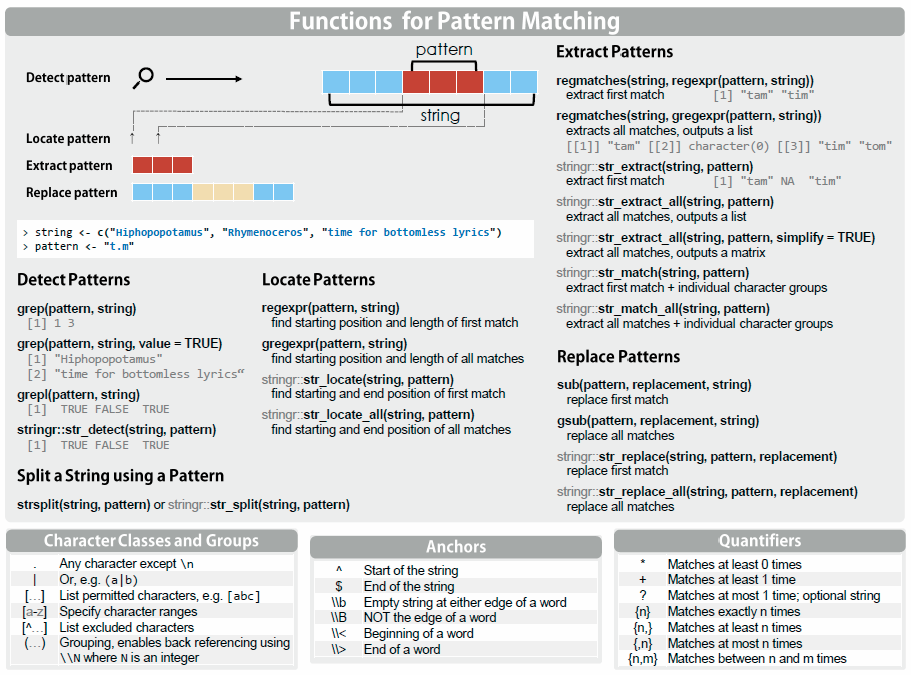

# (PART) R Basics {-} 

# Regular Expressions


(ref:RegExCheat) Cheat sheet for regex

```{r RegExCheat, echo = FALSE, out.width='100%', fig.align = 'center', fig.cap='(ref:RegExCheat)', fig.show = 'hold'}

```


* string input &rarr; regexp &rarr; match
    - each special character (.!?*+\\,...) needs to be escaped
    - because \\ is also used to escape characters in strings we need to escape it in order to send a litheral "\\" to regexp


* `writeLines()` see what is actually sent to regex by providing a certain string
* `stringr::words` common words to test your regex
* `str_view()` and `str_view_all()` to test your regex visibly

