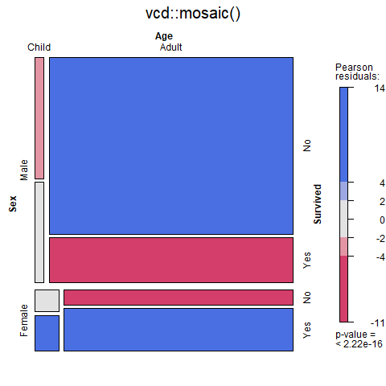
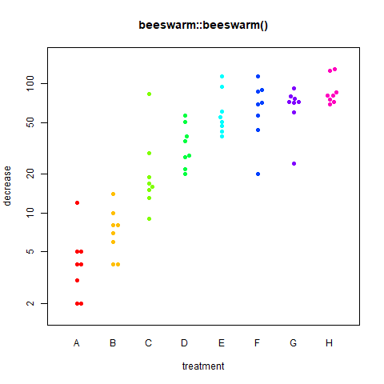
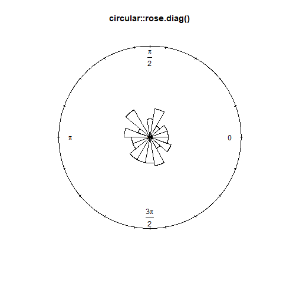
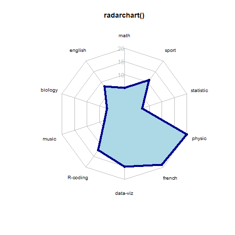

# (PART) R Output {-} 

# Base graphics {#Plots}


## Graphical parameters `par()`

Good overviews:

* [Official Documentation](https://stat.ethz.ch/R-manual/R-devel/library/graphics/html/par.html)
* [Illustrated Documentation](http://rstudio-pubs-static.s3.amazonaws.com/315576_85cccd774c29428ba46969316cbc76c0.html)
* Book R in a Nutshell: A Desktop Quick Reference

### Set graphical parameters
Change global option
```{r}
par(xlog = TRUE)
```

change for local plot
```{r, eval=FALSE}
plot(..., xlog = TRUE)
```

When parameters are set, their previous values are returned in an invisible named list. Such a list can be passed as an argument to par to restore the parameter values.

```{r, eval = FALSE}
opar <- par(xlog = TRUE)
plot(...)
par(opar)
```

reset default

```{r, eval=FALSE}
dev.off()
```

check current parameter

```{r, eval = TRUE}
par("xlog")
```

The parameters are defined for the currently active device

* Normally the Rstudio plot panel
* If `png()` or `pdf()` opend &emsp; &rArr; only within this document
* `dev.off()` closes device and reset `par()`
    + If `png()` or `pdf()` &emsp; &rArr; the same `par` are active as they were before the device `png()` or `pdf()` was opend
    + If Rstudio panel &emsp; &rArr; the default `par` are active


### Default

<button onclick="myFunction('default_par')">Show default par() options</button>

<div id="default_par" style="display: none">
```{r}
par()
```
</div>


### Device

```{r, collapse=TRUE}
par("ask")  # asks user before new figure is drawn
par("new")  # if TRUE, plots next high-level plot above previous
```


### Device region

<!-- {width=50%} -->

<!--  -->

```{r, echo=FALSE}
opar <- par(xpd = NA,
    mar = c(5,4,4,2) + 0.1,
    oma = c(3,3,3,3) + 0.05)

plot(1:10, 1:10, type = "n",
     xlab = "", ylab = "Y")

box("plot", col = "red")
box("inner", col = "green")
box("outer", col = "blue")

text(5,9, "Plot region", col = "red", cex  = 2)
mtext("Figure region", col = "green", cex = 2,
      side = 3, line = 2)
mtext("Device region", col = "blue", cex = 2,
      side = 3, line = 1, outer = T)

mtext(text = c("Line 0",
               "Line 1",
               "Line 2",
               "Line 3"),
      side = 3, line = 0:3,
      at = grconvertX(1, "npc", "user"),
      adj = 1,
      col = "green")

mtext(text = c("Line 0",
               "Line 1",
               "Line 2",
               "Line 3"),
      side = 2, line = 0:3,
      adj = 1,
      col = "green")

mtext(text = c("Line 0",
               "Line 1",
               "Line 2"),
      side = 1, line = 0:2, outer = T,
      at = 0, adj = 0,
      col = "blue")


mtext(text = "Margins",
      side = 1, line = 2, cex = 2)
mtext(text = "par(mar=c(5,4,4,2) + 0.1)",
      side = 1, line = 3)

mtext(text = "Outer Margin",
      side = 1, line = 1, cex = 2, outer = T)
mtext(text = "par(oma=c(3,3,3,3))",
      side = 1, line = 2, outer = T)

par(opar)
```

##### Plot outside plotting region {-}
```{r, collapse=TRUE}
par("xpd")
```

`FALSE`  $\Rightarrow$ clipped to the plot regions  
`TRUE`   $\Rightarrow$ clipped to the figure region  
`NA`     $\Rightarrow$ clipped to the device region


### Coordinate sytem

There are in total 9 coordinate sytems

* absolute
    - $(0,0)$ in lower left device corner
        + `inches` can be converted to cm with function `cm()`
        + `device` usually in pixels (png) or points (pdf)
        + `lines` based on `mex` (relative to font size)
        + `chars` based on `cex` (font size)
    - $(0,0)$ depend on what is plotted
        + `user` user coordinates
* normalized
    - `ndc` normalized device coordinates
    - `nic` normalized inner region coordinates
    - `nfc` normalized figure coordinates
    - `npc` normalized plot coordinates


```{r, echo=FALSE, fig.cap='Interval [0, 1] for different normalized coordinate systems'}
y_pos <- grconvertY(y = c(0.3, 0.2, 0.1), from = "ndc", to = "lines")
opar <- par(xpd = NA,
            mfrow = c(1,2),
            mar = c(y_pos[1], 4, y_pos[3], 2),
            oma = c(y_pos[2], 3, y_pos[3], 3))
plot(1:10, 1:10, type = "n", xlab = "", ylab = "")
box("plot", col = "red")
box("figure", col = "green")
box(which = "inner", col = "orange")
box(which = "outer", col = "blue")
one_line <- grconvertY(y = 0.8, from = "lines", to = "user") -
  grconvertY(y = 0, from = "lines", to = "user")
ar_y <- grconvertY(y = c(0.02, 0.22, 0.32, 0.52), from = "ndc")
arrow_label <- c("ndc", "nic", "nfc", "npc")
for(i in 1:length(arrow_label)){
  ar_x <- grconvertX(x = c(0,1), from = arrow_label[i], to = "user")
  arrows(x0 = ar_x[1], y0 = ar_y[i], x1 = ar_x[2], y1 = ar_y[i], code = 3, length = 0.1)
  text(x = mean(ar_x), y = ar_y[i]+one_line, labels = arrow_label[i])
}
plot(1:10, 1:10, type = "n", xlab = "", ylab = "")
box("plot", col = "red")
par(opar)
``` 


##### Convert between coordinate system {-}
Use `grconvertX()` to convert between different coordinate systems


##### Define `lines` coordinate system {-}
```{r, collapse=TRUE}
par("mex")   # defines lines coordinate system from point size of text, "height" of one line (e.g. space between Line 0 and Line 1)
```


### Define device regions

Useful links: [Device regions](http://www.melissaclarkson.com/resources/R_guides/documents/figure_layout_Ver1.pdf), [fig and fin](http://www.programmingr.com/content/positioning-charts-fig-and-fin/), [oma and mgp](http://www.programmingr.com/content/controlling-margins-and-axes-oma-and-mgp/)

#### Split device

Several options (see [here](https://www.statmethods.net/advgraphs/layout.html))

* array: `par(mfrow = c(2,2))` (`mfcol` fills the array by columns)
    - use `par("mfg")` to plot a specific field in the array
* grid: `layout(matrix())`
* arbitrary locations: `par(fig = ...)` combined with `par(new=TRUE)`
* `split.screen()`
* `pairs()`
* `coplot()`

##### Example for copy paste {-}

```{r}
par(mfrow = c(2, 2)) # 2-by-2 grid of plots
par(oma = c(4, 4, 0, 0)) # make room (i.e. the 4's) for the overall x and y axis titles
par(mar = c(2, 2, 1, 1)) # make the plots be closer together

# now plot the graphs with the appropriate axes removed (via xaxt and yaxt),
# remove axis labels (so that they are not redundant with overall labels,
# and set some other nice choices for graphics parameters
plot(runif(10), xlab = '', ylab = '', xaxt = 'n', las = 1, ylim = c(0, 1))
plot(runif(10), xlab = '', ylab = '', xaxt = 'n', yaxt = 'n', ylim = c(0, 1))
plot(runif(10), xlab = '', ylab = '', las = 1, ylim = c(0, 1))
plot(runif(10), xlab = '', ylab = '', yaxt = 'n', ylim = c(0, 1))

# print the overall labels
mtext('x-axis title', side = 1, outer = TRUE, line = 2)
mtext('y-axis title', side = 2, outer = TRUE, line = 2)
```


##### Useful helper function {-}

```{r, tidy=FALSE}
FunNewPar <- function(oma = c(0,0,2,2),
                      mar = c(4,4,0,0),
                      tcl = -0.3,
                      mgp = c(2,0.5,0),
                      cex.axis = 0.7,
                      ps = 10,
                      xpd = NA){
  x <- par(oma = oma,
           mar = mar,
           tcl = tcl,
           mgp = mgp,
           cex.axis = cex.axis,
           ps = ps,
           xpd = xpd)
  invisible(x)
}
```

Multiple plots with everything

```{r, eval=FALSE}
FunNewPar()
```

Multiple plots without axis title

```{r, eval=FALSE}
FunNewPar(oma = c(1,1,2,2),
          mar = c(3,3,0,0))
```

Multiple plots without axis

```{r, eval=FALSE}
FunNewPar(oma = c(3,3,2,2),
          mar = c(1,1,0,0))
```

```{r, echo=FALSE, out.width='30%', fig.show ='hold', fig.align='default'}
FunNewPar <- function(oma = c(0,0,2,2),
                      mar = c(4,4,0,0),
                      tcl = -0.3,
                      mgp = c(2,0.5,0),
                      cex.axis = 0.7,
                      ps = 10,
                      xpd = NA){
  x <- par(oma = oma,
           mar = mar,
           tcl = tcl,
           mgp = mgp,
           cex.axis = cex.axis,
           ps = ps,
           xpd = xpd)
  invisible(x)
}
opar <- FunNewPar(oma = c(1,1,5,2))

par(mfrow = c(2,2))
plot(1, xlab = "X axis title", ylab = "Y axis title")
plot(1, xlab = "X axis title", ylab = "Y axis title")
plot(1, xlab = "X axis title", ylab = "Y axis title")
plot(1, xlab = "X axis title", ylab = "Y axis title")
mtext(text = "Multiple plots with everything", side = 3, line = 2, outer = T, cex = 3)

FunNewPar(oma = c(1,1,5,2), mar = c(3,3,0,0))
plot(1, xlab = "", ylab = "Y axis title")
plot(1, xlab = "", ylab = "")
plot(1, xlab = "X axis title", ylab = "Y axis title")
plot(1, xlab = "X axis title", ylab = "")
mtext(text = "Multiple plots without axis title", side = 3, line = 2, outer = T, cex = 3)

FunNewPar(oma = c(3,3,5,2), mar = c(1,1,0,0))
plot(1, xlab = "", ylab = "Y axis title", xaxt = "n")
plot(1, xlab = "", ylab = "", xaxt = "n", yaxt = "n")
plot(1, xlab = "X axis title", ylab = "Y axis title")
plot(1, xlab = "X axis title", ylab = "", yaxt = "n")
mtext(text = "Multiple plots without axis", side = 3, line = 2, outer = T, cex = 3)

par(opar)
par(mfrow = c(1,1))
```


#### Margins

Define margine area using `lines` coordinate system

```{r, collapse=TRUE}
par("oma") # Outer Margin Area
par("mar") # Margine Area
```

Define margine area using `inches` coordinate system

```{r, collapse=TRUE}
par("omi") # Outer Margin Area
par("mai") # Margine Area
```


```{r, echo=FALSE}
prep_plot <- function(){
  opar <- par(mfrow = c(1,2))
  par(xpd = NA)
  par(omd = c(0.2,0.9,0.2,0.8))
  par(plt = c(0.3,0.8,0.3,0.7))
  plot.new()
  box(which = "plot", col = "red")
  box(which = "figure", col = "green")
  box(which = "inner", col = "orange")
  box(which = "outer", col = "blue")
  invisible(opar)
}

opar <- prep_plot()

x_blue <- grconvertX(0, from = "ndc")
x_orange <- grconvertX(0, from = "nic")
x_red <- grconvertX(0, from = "npc")
x_red2 <- grconvertX(1, from = "npc")
x_green <- grconvertX(1, from = "nfc")
x_orange2 <- grconvertX(1, from = "nic")

y_bottom1 <- grconvertY(y = 0.05, from = "ndc")
y_bottom2 <- grconvertY(y = 0.1, from = "ndc")
y_middle1 <- grconvertY(y = 0.05, from = "nfc")
y_middle2 <- grconvertY(y = 0.15, from = "nfc")
y_top1 <- grconvertY(y = 0.85, from = "ndc")
y_top2 <- grconvertY(y = 0.9, from = "ndc")


arr <- function(x0, x1, y0, code = 3){
  arrows(x0 = x0, y0 = y0, x1 = x1, y1 = y0, length = 0.1, code = code)
}

arr(x0 = x_blue, x1 = x_orange, y0 = y_middle2)
text(x = mean(c(x_blue, x_orange)), y = y_middle2, labels = "oma, omi", pos = 3)
arr(x0 = x_orange, x1 = x_red, y0 = y_middle1)
text(x = mean(c(x_orange, x_red)), y = y_middle1, labels = "mar, mai", pos = 3)

plot.new()
box(which = "plot", col = "red")
par(opar)
```


Define margine area using `ndc`/`nfc` coordinate system

```{r, collapse=TRUE}
par("omd") # Start and endpoint of inner region  c(x1, x2, y1, y2)
par("fig") # Start and endpoint of figure region c(x1, x2, y1, y2)
par("plt") # Start and endpoint of plot region   c(x1, x2, y1, y2)
```


```{r, echo=FALSE}
prep_plot()
x_blue <- grconvertX(0, from = "ndc")
x_orange <- grconvertX(0, from = "nic")
x_red <- grconvertX(0, from = "npc")
x_red2 <- grconvertX(1, from = "npc")
x_green <- grconvertX(1, from = "nfc")
x_orange2 <- grconvertX(1, from = "nic")

y_bottom1 <- grconvertY(y = 0.05, from = "ndc")
y_bottom2 <- grconvertY(y = 0.1, from = "ndc")
y_middle1 <- grconvertY(y = 0.05, from = "nfc")
y_middle2 <- grconvertY(y = 0.15, from = "nfc")
y_top1 <- grconvertY(y = 0.85, from = "ndc")
y_top2 <- grconvertY(y = 0.9, from = "ndc")

arr(x0 = x_blue, x1 = x_orange, y0 = y_top2, code = 2)
arr(x0 = x_blue, x1 = x_green, y0 = y_top1, code = 2)
text(x = mean(c(x_orange, x_green)), y = y_top1, labels = "fig", pos = 3)

arr(x0 = x_blue, x1 = x_orange, y0 = y_bottom2, code = 2)
arr(x0 = x_blue, x1 = x_orange2, y0 = y_bottom1, code = 2)
text(x = mean(c(x_orange, x_orange2)), y = y_bottom1, labels = "omd", pos = 3)

arr(x0 = x_orange, x1 = x_red, y0 = y_middle2, code = 2)
arr(x0 = x_orange, x1 = x_red2, y0 = y_middle1, code = 2)
text(x = mean(c(x_red, x_red2)), y = y_middle1, labels = "plt", pos = 3)

plot.new()
box(which = "plot", col = "red")
par(opar)
```


Define region dimensions in `inches`

```{r, collapse=TRUE}
par("fin")  # Figure dimensions, (width, height)
par("pin")  # Plot dimensions, (width, height)
```

```{r, echo=FALSE}
prep_plot()
x_blue <- grconvertX(0, from = "ndc")
x_orange <- grconvertX(0, from = "nic")
x_red <- grconvertX(0, from = "npc")
x_red2 <- grconvertX(1, from = "npc")
x_green <- grconvertX(1, from = "nfc")
x_orange2 <- grconvertX(1, from = "nic")

y_bottom1 <- grconvertY(y = 0.05, from = "ndc")
y_bottom2 <- grconvertY(y = 0.1, from = "ndc")
y_middle1 <- grconvertY(y = 0.05, from = "nfc")
y_middle2 <- grconvertY(y = 0.15, from = "nfc")
y_top1 <- grconvertY(y = 0.85, from = "ndc")
y_top2 <- grconvertY(y = 0.9, from = "ndc")


arr(x0 = x_orange, x1 = x_green, y0 = y_top1)
text(x = mean(c(x_orange, x_green)), y = y_top1, labels = "fin", pos = 3)
arr(x0 = x_red, x1 = x_red2, y0 = y_middle1)
text(x = mean(c(x_red, x_red2)), y = y_middle1, labels = "pin", pos = 3)
arr(x0 = x_orange, x1 = x_orange2, y0 = y_bottom1)
text(x = mean(c(x_orange, x_orange2)), y = y_bottom1, labels = "??", pos = 3)

plot.new()
box(which = "plot", col = "red")
par(opar)
```


#### Square plot

```{r, collapse=TRUE}
par("pty") # pty = "m": maximum,  pty = "s": square
```


### User coordinates limits

```{r, collapse=TRUE}
par("usr")  # extremes of the user coordinate system (xmin, xmax, ymin, ymax)
par("xaxs") # "r": xlim +/- 4%, "i": xlim
```


### General appearence
```{r, collapse=TRUE}
par("bg")  # color for the background of the device region. NA => transparent
par("fg")  # color for the foreground (axes, boxes, plotting)
```


### Symbols
```{r, collapse=TRUE}
par("pch") # symbol
par("cex") # magnifies text/symbols relative to default
par("col") # symbol color
```

```{r, echo=FALSE, out.width='50%'}
plot(x = rep(1:6, each = 6)[1:26], y = rep(6:1, 6)[1:26],
     pch = c(0:25), col = "red3", bg = "yellow2", cex = 3,
     xlim = c(0.5, 6.5), ylim = c(0.5, 6.5), xlab = "", ylab = "", main = "pch = ", axes = F,
     panel.first = abline(h = 6:1, v = 1:6, col = "lightgray", lty = 3))
box()
mysym <- c("*", ".", "o", "O", "0", "+", "-", "|", "%", "#")
points(x = rep(1:6, each = 6)[27:36], y = rep(6:1, 6)[27:36],
       pch = mysym, col = "red3", bg = "yellow2", cex = 3)
text(x = rep(1:6, each = 6) - 0.4, y = rep(6:1, 6), labels = c(0:25, mysym))
```


### Lines
```{r, collapse=TRUE}
par("lty")    # line type
par("lwd")    # line width
par("col")    # line color
par("lend")   # line end type
par("ljoin")  # line join style
par("lmitre") # detail to ljoin option "mitre"
```

```{r, echo=FALSE, out.width='50%', fig.show ='hold', fig.align='default'}
par(bty = "n")
plot(x = 0:6, y = 6:0, type = "n", xaxt = "n", ylab = "", xlab = "",
     main = "Line Types: lty =", ylim = c(6.5, -0.5), las = 2)
abline(h = 0:6, lty = 0:6)
text(x = 1, y = 0:6, labels = c("blank", "solid", "dashed", "dotted", "dotdash", "longdash", "twodash"), pos = 3)

# par(mar = c(1,3,3,1)+0.1)
plot(1:3, 0:2, type = "n", ylim = c(2.5, -0.5), yaxt = "n", xaxt = "n", xlab = "", ylab = "", main = "lend =")
axis(2, at = 0:2, las = 2)
abline(v = 2, lty = 2)
lines(x = c(1,2), y = c(0,0), lwd = 25, lend = 0)
lines(x = c(1,2), y = c(1,1), lwd = 25, lend = 1)
lines(x = c(1,2), y = c(2,2), lwd = 25, lend = 2)
text(x = 2.5, y = 0, label = "\"round\"")
text(x = 2.5, y = 1, label = "\"butt\"")
text(x = 2.5, y = 2, label = "\"square\"")

# par(mar = c(1, 2,2,1))
y=c(2.5, 0, 2.5)
par(ljoin=0)
plot(y, lwd = 20, type = "l", ylim = c(2.5, -0.6), xlim = c(1, 5),
     xaxt = "n", yaxt = "n", main = "ljoin =", xlab = "", ylab = "")
axis(2, at = 0:2)
par(ljoin=1)
lines(y+1,lwd=20,type="l")
par(ljoin=2)
lines(y+2,lwd=20,type="l")
text(x = 3.8, y = 0, label = "\"round\"")
text(x = 3.8, y = 1, label = "\"mitre\"")
text(x = 3.8, y = 2, label = "\"bevel\"")
```


### Text
```{r, collapse=TRUE}
par("font")    # text font
par("family")  # text font family
par("cex")     # magnifies text/symbols relative to default
par("ps")      # text pointsize
par("col")     # text color
par("srt")     # string rotation in degrees (°)
par("lheight") # vertical spacing in multi-line text
```

Point size of text = `ps` * `cex`

Point size of title = `ps` * `cex` * `cex.main`

Size of "lines" (coordinate system) = constant * `cex` * `mex`


```{r, echo=FALSE, out.width='50%', fig.show ='hold', fig.align='default'}

par(bty = "n")
plot(1:5, ylim = c(5.5,0.5), type = "n", xlab = "", ylab = "", xaxt = "n", main = "font = ")
opar <- par(cex = 2)
text(x = 1, y = 1, labels = "plain", font = 1, pos = 4)
text(x = 1, y = 2, labels = "bold", font = 2, pos = 4)
text(x = 1, y = 3, labels = "italic", font = 3, pos = 4)
text(x = 1, y = 4, labels = "bold italic", font = 4, pos = 4)
text(x = 1, y = 5, labels = "symbol", font = 5, pos = 4)
text(x = 3, y = 5, labels = "symbol ('d' => delta)", pos = 4, cex = 0.75)
par(opar)

plot(1:3, ylim = c(4,0), type = "n", xlab = "", ylab = "", xaxt = "n", main = "family =", yaxt = "n")
par(cex = 2)
text(1,1,pos=4, family = "sans", "sans (= default)")
text(1,2,pos=4, family = "serif", "serif")
text(1,3,pos=4, family = "mono", "mono")
```


Get new text families with packet extrafont (see [here](http://blog.revolutionanalytics.com/2012/09/how-to-use-your-favorite-fonts-in-r-charts.html))

```{block2, type='rmdwarning'}
You could also use this command to get your fonts from Windows `windowsFonts(MyFont = windowsFont("NameFromWord"))`, however with this way the new font cannot be printed to PDF.
```


### Axis labels
```{r, collapse=TRUE}
par("font.lab")
par("cex.lab")
par("col.lab")
par("ann")   # should there be any annotations (title, axis title)
par("adj")   # axis title position (0: left, 1: right)
par("mgp")   # position of 1) labels, 2) tick-mark labels, 3) tick marks (in lines)
```


### Axis
```{r, collapse=TRUE}
par("font.axis")
par("cex.axis")
par("col.axis")
par("xaxt") # should there be an axis ("n" suppresses axis)
par("las")  # orientation of tick-mark labels (0: parallel, 1: horizontal, 2: perpendicular, 3: vertical)
par("mgp")  # position of 1) labels, 2) tick-mark labels, 3) tick marks (in lines)
```


### Ticks
```{r, collapse=TRUE}
par("mgp")  # position of 1) labels, 2) tick-mark labels, 3) tick marks (in lines)
par("tck")  # length of tick marks (in npc), 1 => grid lines
par("tcl")  # length of tick marks (in chars), negative => look outside plot
par("lab")  # ≈ number of ticks per axis (x-axis, y-axis, unimplementent)
par("xaxp") # look where ticks are plotted (lower xlim, upper xlim, nr of ticks minus 1)
par("xaxs") # "r": xlim +/- 4%, "i": xlim
par("xlog") # log x axis
```


### Box
```{r, collapse=TRUE}
par("bty")  # one of  "o", "l", "7", "c", "u", "]", no box: "n"
```


### Title
```{r, collapse=TRUE}
par("font.main")
par("cex.main")
par("col.main")
par("font.sub")
par("cex.sub")
par("col.sub")
par("ann")     # should there be any annotations (title, axis title)
```


### R.O. (Read only)

```{r, collapse=TRUE}
par("cin")  # character size (width, height) in inches
par("cra")  # character size (width, height) in pixels
par("csi")  # same as par("cin")[2]
par("cxy")  # character size (width, height) in user coordinate system
par("din")  # device dimensions (width, height) in inches
par("page") # A boolean value indicating whether the next call to plot.new is going to start a new page
```


### Useless

```{r, collapse=TRUE}
par("crt")    # rotate single characters, does NOT work on most devices.
par("ylbias") # used in positioning of text in margin (no effect?)
par("err")    # unimplemented
par("mkh")    # unimplemented
par("smo")    # unimplemented
```


## Colors

Very well explained [here](http://www.melissaclarkson.com/resources/R_guides/documents/colors_Ver2.pdf)

Specify by:

* Name
    - example `col = "black"`
    - possible names: `colors()`
* Hexadecimal RGB code
    - example `col = "#000000"` => black
    - format `"#RRGGBB"`
    - RR, GG, BB are hexadecimal digits (00 to FF)
* Index
    - example `col = 1` => black
    - index gives colors position in `palette()`
    - `palette()` can be manipulated
        + restore default palette with `palette("default")`
    - Special: index 0 is background color


Default palette:

```{r, echo=FALSE, out.width='50%'}
plot(x = rep(1:3, 3), y = rep(1:3, each = 3),
     ylim = c(3.5,0.5), xlim = c(0.5,3.5),
     pch = 15, col = 0:8, cex = 12,
     xlab = "", ylab = "",
     axes = F, main = "col = ")
box()
text(x = rep(1:3, 3), y = rep(1:3, each = 3), labels = 0:8)
```

Change palette

```{r, eval=FALSE}
mycols <- gray.colors(n = 4, start = 0, end = 0.8)
palette(mycols)       # change palette
plot(..., col = 1:4)  # make plots using indices for colors
palette("default")    # restore default palette
```


### Convert from/to different color specification

##### RGB {-}
* `rgb()`
    - converts RGB to hexadecimal
* `col2rgb()`
    - converts R colors (hexadecimal, name, index) to RGB

##### HSV {-}
`hsv()` converts HSV to hexadecimal

##### HCL {-}
`hcl()` converts HCL to hexadecimal


### Make new palettes

Create a vector of $n$ continuous colors. All of them (except for `gray.colors`) have additionally an argument `alpha` for transparency.

```{r, eval=FALSE}
gray.colors(n)
heat.colors(n)
cm.colors(n)
terrain.colors(n)
topo.colors(n)
rainbow(n)
```

```{r, echo=FALSE}
# ---------------------------------------------------------------------------------------
# ----- creating vectors of contiguous colors -------------------------------------------
# ----- (a line through three-dimensional color space) ----------------------------------

old_par <- par(no.readonly = TRUE)	# save current graphical parameters
par(bg="gray87")					# set background of device region  to gray
par(xaxt="n", yaxt="n")				# do not draw axes
par(mar=c(3, 3, 3, 3))				# set margins

plot(0,0, type="n", xlim=c(0,16), ylim=c(1,7), xlab=NA, ylab=NA, axes=FALSE, bty="n")
title(main="Functions to make vectors of contiguous colors", line=0)

color_vector <- c("rainbow(16)", "topo.colors(16)", "terrain.colors(16)",
                  "cm.colors(16)", "heat.colors(16)", "gray.colors(16)")
for (i in 1:6) {					# make five versions of the vector of colors
  col_vec <- eval(parse(text=color_vector[i]))  # evaluates string as function
  for(k in 1:16) {
    x_left <- k-1
    x_right <- k
    y_bottom <- i
    y_top <- i+0.8
    rect(x_left, y_bottom, x_right, y_top, col=col_vec[k], border="gray60")
  }
  text(0, i-0.08, color_vector[i], col="gray40", adj=0, cex=0.7)
} 
par(old_par)
```

##### Further palettes {-}
* `hcl.colors`
    - many different palettes implemented (including famous "viridis" palette)
* `hsv()` / `hcl()`
    - fix 2 parameters and let one parameter continuously increase

### Partially transparent colors

* Add two more digits to hexadecimal code, which define transparency
    - `#RRGGBBaa`
* Use `alpha()` function of package `ggplot2`

```{r, eval=FALSE}
require(ggplot2)
plot(..., col = alpha(gray, 0.5))
```


## Mathematical annotation

Useful helpfile: [Mathematical annotation in R](https://stat.ethz.ch/R-manual/R-devel/library/grDevices/html/plotmath.html)

If the text argument to one of the text-drawing functions (text, mtext, axis, legend, title) in R is an expression, the argument is interpreted as a mathematical expression and the output will be formatted according to TeX-like rules.

Functions to create objects of mode "expression"

* `expression()`
* `bquote()`
    - same as `expression()` but variables/terms wrapped in `.()` are evaluated


Importand special symbols in expressions

* `*` connects two parts without a space
* `~` connects two parts with space
* `^` superscript
* `[]` subscript 

An extensive overview can be found in the following tables. The columns of grey text show sample R expressions, and the columns of black text show the resulting output.

```{r, echo=FALSE, results='hide', fig.show='hold', fig.align='default', out.width='50%', fig.width=7, fig.height=7}
demo("plotmath")
```

##### Example {-}

```{r, fig.height=2, out.width='50%'}
a <- 1.34
label1 <- bquote(R[adj]^2 == ~ .(a) ~ "[" * mu * mol %.% s^-1 %.% m^-2 * "]" %=>% supi ~ hat(x) ~ sum(x[i], i == 1, n))

par(mar = c(0,0,0,0)+0.5)
plot(1, type = "n")
text(1,1, labels = label1, cex = 1.5)
```


## High level plots

Links:

* [R Graph Gallery](https://www.r-graph-gallery.com/)
* [Simple graphs](https://www.harding.edu/fmccown/r/)
* [3D plots](http://pj.freefaculty.org/guides/Rcourse/plot-3d/plots-3d.pdf)

Common high level plot functions

* 1D continuous
    - `curve()`
    - `hist()`
    - `stripchart()`
    - `dotchart()`
    - `beeswarm::beeswarm()`
* 1D discrete
    - `barplot()`
    - `spineplot()`
    - `pie()`
* 2D continuous - continuous
    - `plot.default()`
    - `scatter.smooth()`
    - `matplot()`
    - `pairs()`
* 2D continuous - discrete
    - `boxplot()`
    - `stripchart()`
    - `dotchart()`
    - `barplot()`
    - `beeswarm::beeswarm()`
    - `spineplot()`
    - `pie()`
* 2D discrete - discrete
    - `mosaicplot()` / `vcd::mosaic()`
* 3D
    - `contour()`
    - `filled.contour()`
    - `image()`
    - `persp()`
    - `rgl::plot3d()`
* ANOVA
    - `interaction.plot()`
    - `plot.design()`
* Multivariate
    - `pairs()`
    - Bubble Plot
    - `coplot()`
    - `stars()`
    - `mosaicplot()`
* Distribution
    - `qqplot()`
* Interactive
    - `identify()`
    - plot.ly (interactive plots)
    - shiny (interactive web apps)


```{r, out.width='30%', echo=FALSE, fig.show='hold', fig.align='default'}

par(cex.main = 2)

# scatter.smooth() --------------------------------------------------------
set.seed(1)
scatter.smooth(x = 1:10, y = rnorm(10), lpars = list(col = "red"),
               xlab = "X", ylab = "Y", main = "scatter.smooth()")

# curve() -----------------------------------------------------------------
curve(dnorm, -5, 5, main = "curve()")

# matplot() ---------------------------------------------------------------
sines <- outer(1:20, 1:4, function(x, y) sin(x / 20 * pi * y))
matplot(sines, lwd = 2, type = "l", col = gray.colors(ncol(sines)), lty = 1,
        main = "matplot()", xlab = "")

# hist() ------------------------------------------------------------------
set.seed(1)
hist(rnorm(100), main = "hist()", xlab = "X", col = "lightgray")

# boxplot() ---------------------------------------------------------------
boxplot(count ~ spray, data = InsectSprays, col = "lightgray", main = "boxplot()")

# stripchart() ------------------------------------------------------------
stripchart(decrease ~ treatment,
           main = "stripchart()",
           vertical = TRUE, log = "y", data = OrchardSprays)

# dotchart() --------------------------------------------------------------
dotchart(t(VADeaths), xlim = c(0,100), bg = "skyblue",
         main = "dotchart()")

# barplot() ---------------------------------------------------------------
barplot(GNP ~ Year, data = longley, main = "barplot()")

# spineplot() -------------------------------------------------------------
spineplot(margin.table(UCBAdmissions, c(3, 2)),
           main = "spineplot()")

# pie() -------------------------------------------------------------------
pie(c(Sky = 78, "Sunny side of pyramid" = 17, "Shady side of pyramid" = 5),
    init.angle = 315, col = c("deepskyblue", "yellow", "yellow3"),
    border = FALSE, main = "pie()")

# contour() ---------------------------------------------------------------
x <- -6:16
contour(outer(x, x), main = "contour()")

# filled.contour() --------------------------------------------------------
filled.contour(volcano, asp = 1, main = "filled.contour()")


# image() -----------------------------------------------------------------
x <- 10*(1:nrow(volcano))
y <- 10*(1:ncol(volcano))
image(x, y, volcano, col = hcl.colors(100, "terrain"), axes = TRUE,
      main = "image()")

# interaction.plot() ------------------------------------------------------
with(CO2[CO2$conc == 1000,],
     interaction.plot(x.factor = Type, trace.factor = Treatment, response = uptake,
                      main = "intaraction.plot()"))

# plot.design() -----------------------------------------------------------
plot.design(uptake ~ Type + Treatment, data = CO2, main = "plot.design()")

# qqnorm() ----------------------------------------------------------------
set.seed(1)
y <- rt(200, df = 5)
qqnorm(y, main = "qqnorm()")
qqline(y, col = 2)

# pairs -------------------------------------------------------------------
panel.cor <- function (x, y, digits = 2, prefix = "", cex.cor, text_pos = c(0.5, 
    0.5), ...) 
{
    usr <- par("usr")
    on.exit(par(usr))
    par(usr = c(0, 1, 0, 1))
    r <- cor(x, y, use = "pairwise.complete")
    r2 <- abs(cor(x, y, use = "pairwise.complete"))
    txt <- format(c(r, 0.123456789), digits = digits)[1]
    txt <- paste0(prefix, txt)
    if (missing(cex.cor)) 
        cex.cor <- 0.8/strwidth(txt)
    text(text_pos[1], text_pos[2], txt, cex = cex.cor * r2)
}
panel.hist <- function (x, ...) 
{
    usr <- par("usr")
    on.exit(par(usr))
    par(usr = c(usr[1:2], 0, 1.5))
    h <- hist(x, plot = FALSE)
    breaks <- h$breaks
    nB <- length(breaks)
    y <- h$counts
    y <- y/max(y)
    rect(breaks[-nB], 0, breaks[-1], y, col = "#E34A33", 
        ...)
}
pairs(x = iris, lower.panel = panel.smooth,
      upper.panel = panel.cor, diag.panel = panel.hist, main = "pairs()")

# Bubble plot -------------------------------------------------------------
plot(swiss$Fertility, swiss$Examination, cex = swiss$Catholic/50+1,
     pch = 21, bg = "red", xlab = "Fertility", ylab = "Army fitness",
     main = "Bubble plot")
leg_size <- c(0,40,80)
legend("topright", legend = leg_size, pch = 21, pt.bg = "red", pt.cex = leg_size/50+1, title = "% Catholic")

# Conditioning plot -------------------------------------------------------
coplot(lat ~ long | depth, data = quakes, main = "coplot()")

# mosaic plot -------------------------------------------------------------
mosaicplot(~ Sex + Age + Survived, data = Titanic,
           main = "mosaicplot()", shade = TRUE)

# stars plot --------------------------------------------------------------
palette(rainbow(12, s = 0.6, v = 0.75))
stars(mtcars[, 1:7], len = 0.8, key.loc = c(12, 1.5),
      main = "stars()", draw.segments = TRUE)
palette("default")

# 3D plot -----------------------------------------------------------------
x <- seq(-10, 10, length= 30)
y <- x
f <- function(x, y) { r <- sqrt(x^2+y^2); 10 * sin(r)/r }
z <- outer(x, y, f)
z[is.na(z)] <- 1
op <- par(bg = "white")
persp(x, y, z, theta = 30, phi = 30, expand = 0.5, col = "lightblue", main = "persp()")
```

```{r, out.width='30%', echo=FALSE, fig.show='hold', fig.align='default'}
# with packages -----------------------------------------------------------

# vcd::mosaic -------------------------------------------------------------
## vcd mosaic plots are nicer
# png("figures/plots/vcd_mosaic.png")
# vcd::mosaic(~ Sex + Age + Survived, data = Titanic,
#             main = "vcd::mosaic()", shade = TRUE, legend = TRUE)
# dev.off()


# bee-swarm plot ----------------------------------------------------------
# png("figures/plots/beeswarm.png")
# beeswarm::beeswarm(decrease ~ treatment,
#                    data = OrchardSprays, log = TRUE, 
#                    pch = 16, col = rainbow(8), main = "beeswarm::beeswarm()")
# dev.off()


# rose.diag() -------------------------------------------------------------
# png("figures/plots/circular.png")
# set.seed(1)
# x <- circular::circular(runif(50, 0, 2*pi))
# circular::rose.diag(x, bins = 18, main = 'circular::rose.diag()')
# dev.off()


# radarchart() ------------------------------------------------------------
# png("figures/plots/radarchart.png")
# set.seed(1)
# data <- as.data.frame(matrix( sample( 2:20 , 10 , replace=T) , ncol=10))
# colnames(data) <- c("math" , "english" , "biology" , "music" , "R-coding", "data-viz" , "french" , "physic", "statistic", "sport" )
# data <- rbind(rep(20,10) , rep(0,10) , data)
# fmsb::radarchart( data  , axistype=1 ,
#                   #custom polygon
#                   pcol="blue4" , pfcol="lightblue" , plwd=4 , 
#                   #custom the grid
#                   cglcol="grey", cglty=1, axislabcol="grey", caxislabels=seq(0,20,5), cglwd=0.8,
#                   #custom labels
#                   vlcex=0.8,
#                   title = "radarchart()")
# dev.off()


```


### Plot function

Type argument

```{r, echo=FALSE}
par(mfrow = c(3,3), mar = c(1,1,1,1), oma = c(0,0,4,0))
type_letters <- c("p", "l", "b", "c", "o", "h", "s", "S", "n")
for(i in type_letters){
  plot(1:10, type = i, ann = FALSE, axes = FALSE)
  text(x = 2, y = 8, labels = i, cex = 3, family = "mono")
  title(main = "type =", outer = TRUE)
  box()
}
```

For pmf use `type = "h"` and for cdf use `type = "s"`


### Example: Barplot

```{r}
myData <- aggregate(mtcars$mpg,
                    by = list(cyl = mtcars$cyl, gears = mtcars$gear),
                    FUN = function(x) c(mean = mean(x), sd = sd(x),
                                        n = length(x)))
myData <- do.call(data.frame, myData)
myData$se <- myData$x.sd / sqrt(myData$x.n)
colnames(myData) <- c("cyl", "gears", "mean", "sd", "n", "se")
myData$names <- c(paste(myData$cyl, "cyl /", myData$gears, " gear"))

par(mar = c(5, 6, 4, 5) + 0.1)

plotTop <- max(myData$mean) +
  myData[myData$mean == max(myData$mean), 6] * 3

barCenters <- barplot(height = myData$mean,
                      names.arg = myData$names,
                      beside = true, las = 2,
                      ylim = c(0, plotTop),
                      cex.names = 0.75, xaxt = "n",
                      main = "barplot()",
                      ylab = "Miles per Gallon",
                      border = "black", axes = TRUE)

text(x = barCenters, y = par("usr")[3] - 1, srt = 45,
     adj = 1, labels = myData$names, xpd = TRUE)

arrows(barCenters, myData$mean - myData$se, barCenters,
       myData$mean + myData$se, lwd = 1.5, angle = 90,
       code = 3, length = 0.05)
```


### Example: Matplot
```{r}
den.df <- 2:20
num.df <- 2:20
mq <- matrix(0, nrow = length(den.df), ncol = length(num.df))
for(i in seq_along(den.df)){
  mq[i,] <- qf(0.95, num.df, den.df[i])
}
## den.df: x coordinates of lines (recycled in this case)
## mq: y coordinates of lines, here: matrix
##     each column give y coordinate of one line
matplot(den.df, mq, type = "l", xlab = "den.df", ylab = "95%-quantile")
```


## Low level plots

* Points
    -`points()`
* Lines
    - `lines()`  (connect several points)
    - `segments()` (connect pairs of points)
    - `arrows()`
    - `curve()`
    - `abline()`
* Bodies
    - `rect()`
    - `polygon()`
    - `symbols()`
* Text
    - `text()`
    - `mtext()`
    - `legend()`
    - `title()`
* Plot elements
    - `axis()`
    - `box()`
* Add-ons
    - `grid()` grid behind plot
    - `rug()` small ticks at bottom of e.g. `hist()`
    - `axis.break()`
    - `plotrix::axis.break()` break of axis

```{block2, type='rmdtip'}
Useful function for text: `strwidth()`. Returns width or height of strings in user coordinates.
```


### Legends

```{r, echo=FALSE, fig.show='hold', fig.align='default', out.width='50%'}
plot(1, xlab = "", ylab = "", main = "legend position", type = "n")
mypos <- c("bottomleft", "bottom", "bottomright", "right",
           "left", "center", "right", "topleft", "top")
for(i in mypos){
  legend(i, legend = "", title = i)
}
legend("topright", legend = "", title = "topright, inset = 0.05", inset = 0.05)


plot(1, ann = FALSE, axes = FALSE, type = "n")
par(cex = 2)
legend("left",
       legend = c("treat", "cont", "cont2"),
       lty = c(NA, 1, 2),
       pch = c(21,NA, 22),
       col = c("blue", "red", "green"),
       pt.bg = c("lightblue", NA,  "lightgreen"))
par(lend = 1)
col1 <- "slateblue4"
col2 <- "firebrick3"
legend("right",
       bty = "n",  # draw no box
       legend = c("historical", "RCP2.6", "RCP8.5"),
       lty = 1, col = ggplot2::alpha(c("black", col1, col2),0.4),
       lwd = 15)
legend("right", bty = "n",
       legend = c("historical", "RCP2.6", "RCP8.5"),
       lty = 1, col = c("black ", col1, col2),
       lwd = 1)
```


### Arrow

```{r, eval=FALSE, tidy=FALSE}
arrows(x0, y0, x1 = x0, y1 = y0,
       length = 0.25,
       angle = 30,
       code = 2)
```


```{r, echo=FALSE, fig.show='hold', fig.align='default', out.width='50%'}
plot(x = c(1.75, 4.25), y = c(-0.5,3.5), type = "n",
     main = "code = ", xaxt = "n", xlab = "", ylab = "",
     ylim = c(3.5, -0.5))
arrows(2,0,4,0, code = 0)
arrows(2,1,4,1, code = 1)
arrows(2,2,4,2, code = 2)
arrows(2,3,4,3, code = 3)

plot(x = c(1.75, 4.25), y = c(-0.5,3.5), type = "n",
     main = "angle = ", yaxt = "n", xaxt = "n", xlab = "", ylab = "")
arrows(2,0,3,0, code = 3, angle = 90, length = 0.05)
arrows(2,1,3,1, code = 3, angle = 120)
arrows(2,2,3,2, code = 3, angle = 10, length = 0.5)
arrows(2,3,3,3, code = 3, angle = 10)
mycex <- 0.7
text(3.75, 0, "angle = 90, length = 0.05", cex = mycex)
text(3.75, 1, "angle = 120", cex = mycex)
text(3.75, 2, "angle = 10, length = 0.5", cex = mycex)
text(3.75, 3, "angle = 10", cex = mycex)
```


### panel.first

plot something behind actual plot

```{r, out.width='50%'}
plot(1:10,1:10, pch = 16,
     panel.first = abline(h = seq(2,10,2),
                          col = "lightgray"))
```

### Area under curve

```{r, out.width='50%'}
x <- seq(-4,4,0.01)
y <- dnorm(x)
plot(y ~ x, type = "l")

upper_bond <- 4
lower_bond <- 2

auswahl <- x <= upper_bond & x >= lower_bond
x_polygon <- x[auswahl]
y_polygon <- y[auswahl]

polygon(c(lower_bond, x_polygon, upper_bond),
        c(0, y_polygon, 0),
        col = "red", border = NA)
abline(h = 0)
abline(v = 2)
```


## Plot empty

##### Plot without axis/box {-}
```{r, eval=FALSE}
par( ann = FALSE      # no titles
    , bty = "n"   # no box
    , xaxt = "n"  # no x axis
    , yaxt = "n"  # no y axis
    )
```

##### Plot empty {-}
```{r, eval=FALSE}
# Perfect
plot.new()

# Good
plot(0, type = "n", axes = FALSE, ann = FALSE)
```


