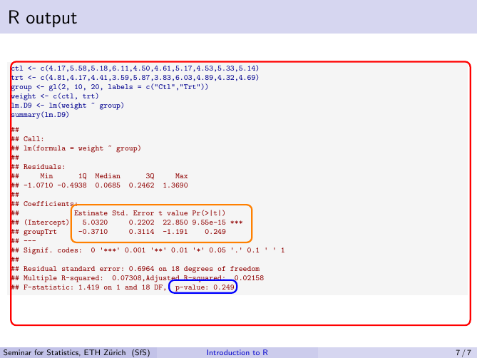

# Latex

## Symbols

[List of mathematical symbols](https://oeis.org/wiki/List_of_LaTeX_mathematical_symbols)


<table class = "deftab">
  <tr>
    <td>**Space**</td>
    <td> </td>
  </tr>
  <tr>
    <td>space</td>
    <td>`\hspace{35pt}`</td>
  </tr>
  <tr>
    <td>space</td>
    <td>`\qquad`</td>
  </tr>
  <tr>
    <td>big space</td>
    <td>`\;`</td>
  </tr>
  <tr>
    <td>medium space</td>
    <td>`\:`</td>
  </tr>
  <tr>
    <td>small space</td>
    <td>`\,`</td>
  </tr>
  <tr>
    <td>negative space</td>
    <td>`\!`</td>
  </tr>
  <tr>
    <td>**Math**</td>
    <td> </td>
  </tr>
  <tr>
    <td>$\approx$</td>
    <td>`\approx`</td>
  </tr>
  <tr>
    <td>$\neq$</td>
    <td>`\neq`</td>
  </tr>
  <tr>
    <td>$\leq$</td>
    <td>`\leq`</td>
  </tr>
  <tr>
    <td>$\sim$</td>
    <td>`\sim`</td>
  </tr>
  <tr>
    <td>$\in$</td>
    <td>`\in`</td>
  </tr>
  <tr>
    <td>$\Rightarrow$</td>
    <td>`\Rightarrow`</td>
  </tr>
  <tr>
    <td>$\mid$</td>
    <td>`\mid`</td>
  </tr>
  <tr>
    <td>$\times$</td>
    <td>`\times`</td>
  </tr>
  <tr>
    <td>$\otimes$</td>
    <td>`\otimes`</td>
  </tr>
  <tr>
    <td>$\partial$</td>
    <td>`\partial`</td>
  </tr>
  <tr>
    <td>$\infty$</td>
    <td>`\infty`</td>
  </tr>
  <tr>
    <td>$\infty$</td>
    <td>`\infty`</td>
  </tr>
  <tr>
    <td>$\mathbb{R}$</td>
    <td>`\mathbb{R}`</td>
  </tr>
    <tr>
    <td>$\underbrace{\cdots}_{\cdots}$</td>
    <td>`\underbrace{\cdots}_{\cdots}`</td>
  </tr>
  <tr>
    <td>$\binom{n}{k}$</td>
    <td>`\binom{n}{k}`</td>
  </tr>
</table>

## Important

```{block2, type='rmdcaution'}
A dot which is not used as the end of a scentence has to be followed by a backslash (/). Otherwise there is too much space afterwards. Important for abbriviations like e.g., i.e., etc., et al., ...
```


## Reto Math

```{block2, type='rmdcaution'}
These are only working if the output is a pdf and the RetoMath.sty preamble is included
```

<table class = "deftab">
  <tr>
    <td>bold math</td>
    <td>`\bm`</td>
  </tr>
  <tr>
    <td>inverse</td>
    <td>`\inv`</td>
  </tr>
  <tr>
    <td>transpose</td>
    <td>`\tr`</td>
  </tr>
</table>

## SfS

```{block2, type='rmdcaution'}
These are only working if the output is a pdf and the RetoMath.sty preamble is included
```

<table class = "deftab">
  <tr>
    <td>R</td>
    <td>`\Rp`</td>
  </tr>
  <tr>
    <td>$E[\dots]$</td>
    <td>`\ERW{}`</td>
  </tr>
  <tr>
    <td>$\text{Var()}$</td>
    <td>`\VAR{}`</td>
  </tr>
  <tr>
    <td>$\hat{\text{Var}}()$</td>
    <td>`VARH{}`</td>
  </tr>
  <tr>
    <td>$\text{Cov()}$</td>
    <td>`\COV{}`</td>
  </tr>
  <tr>
    <td>$\hat{\text{Cov}}()$</td>
    <td>`COVH{}`</td>
  </tr>
  <tr>
    <td>$\text{P}[X = c]$</td>
    <td>`\PR{}`</td>
  </tr>
  <tr>
    <td>$\text{N}()$</td>
    <td>`\Normal{}`</td>
  </tr>
  <tr>
    <td>$\text{N}_n()$</td>
    <td>`\Normali{n}{}`</td>
  </tr>
  <tr>
    <td>$\text{B}()$</td>
    <td>`\Binomial{}`</td>
  </tr>
  <tr>
    <td>$\text{Bernoulli}()$</td>
    <td>`\Bernoulli{}`</td>
  </tr>
  <tr>
    <td>$\text{Exp}()$</td>
    <td>`\Exponential{}`</td>
  </tr>
  <tr>
    <td>$\text{Pois}()$</td>
    <td>`\Poisson{}`</td>
  </tr>
</table>

| Command                | Result                  | Command                    | Result                      | Command                | Result                  |
|------------------------|-------------------------|----------------------------|-----------------------------|------------------------|-------------------------|
| `\ERW{X}`              | $\ERW{X}$               | `\ERWi{X}`                 | $\ERWi{n}{X}$               | `\ERWSymbol`           | $\ERWSymbol$            |
| `\VAR{X}`              | $\VAR{X}$               | `\VARi{n}{X}`              | $\VARi{n}{X}$               | `\VARSymbol`           | $\VAR{X}$               |
| `\VARH{X}`             | $\VARH{X}$              | `\VARHi{n}{X}`             | $\VARHi{n}{X}$              | `\wh\VARSymbol`        | $\wh\VARSymbol$         |
| `\COV{X,Y}`            | $\COV{X,Y}$             | `\COVi{n}{X,Y}`            | $\COVi{n}{X,Y}$             | `\COVSymbol`           | $\COVSymbol$            |
| `\COVH{X,Y}`           | $\COVH{X,Y}$            | `\COVHi{n}{X,Y}`           | $\COVHi{n}{X,Y}$            | `\wh\COVSymbol`        | $\wh\COVSymbol$         |
| `\COR{X,Y}`            | $\COR{X,Y}$             | `\CORi{n}{X,Y}`            | $\CORi{n}{X,Y}$             | `\CORSymbol`           | $\CORSymbol$            |
| `\CORH{X,Y}`           | $\CORH{X,Y}$            | `\CORHi{n}{X,Y}`           | $\CORHi{n}{X,Y}$            | `\wh\CORSymbol`        | $\wh\CORSymbol$         |
| `\PR{X = c}`           | $\PR{X = c}$            | `\PRi{n}{X = c}`           | $\PRi{n}{X = c}$            | `\PRSymbol`            | $\PRSymbol$             |
| `\Normal{\mu, 1}`      | $\Normal{\mu, 1}$       | `\Normali{n}{\mu, 1}`      | $\Normali{n}{\mu, 1}$       | `\NormalSymbol`        | $\NormalSymbol$         |
| `\Binomial{n,p}`       | $\Binomial{n,p}$        | `\Binomiali{n}{n,p}`       | $\Binomiali{n}{n,p}$        | `\BinomialSymbol`      | $\BinomialSymbol$       |
| `\Bernoulli{p}`        | $\Bernoulli{p}$         | `\Bernoullii{n}{p}`        | $\Bernoullii{n}{p}$         | `\BernoulliSymbol`     | $\BernoulliSymbol$      |
| `\Exponential{\lambda}`| $\Exponential{\lambda}$ | `\Exponentiali{n}{\lambda}`| $\Exponentiali{n}{\lambda}$ | `\ExponentialSymbol`   | $\ExponentialSymbol$    |
| `\Poisson{\lambda}`    | $\Poisson{\lambda}$     | `\Poissoni{n}{\lambda}`    | $\Poissoni{n}{\lambda}$     | `\PoissonSymbol`       | $\PoissonSymbol$        |


## Constructs

<table class = "deftab">
  <tr>
    <td>$\begin{pmatrix} b_1 \\ \vdots \\ b_n \end{pmatrix}$</td>
    <td>`\begin{pmatrix} b_1 \\ \vdots \\ b_n \end{pmatrix}`</td>
  </tr>
</table>

## Text format

Colored text

`\textcolor{red}{...text...}`

## Math environments

Reto Math supports Theorems, Definitions, Results, Proofs and Examples. Definitions are followed by a black diamond ($\blacklozenge$), Proofs by an open square ($\square$) and examples by a filled square($\blacksquare$).

Example

```latex
\begin{example}
  This is an example
\end{example}
```

If math environment ends with display (equation block) add `\qedhere` to end of equation such that symbol is on same line as the equation and no page break can happen between end of equation and symbol.

```latex
\begin{example}
  This is an example
  \begin{equation*}
    x = 1+2 \qedhere
  \end{equation*}
\end{example}
```

Detailed information [here](https://tex.stackexchange.com/questions/16453/denoting-the-end-of-example-remark/32394#32394)

Consider replacing the current solution with package `ntheorem` (reasons outlined [here](https://tex.stackexchange.com/questions/232438/using-qedhere-automatically-in-every-proof). However, there are also arguments against it [here](https://tex.stackexchange.com/questions/5599/theorem-packages-which-to-use-which-conflict))


## Useful packages

* [siunitx](https://mirror.ox.ac.uk/sites/ctan.org/macros/latex/contrib/siunitx/siunitx.pdf)
  - Well formatted SI units
  - Well formatted scientific number notation

## Beamer package

* Themes and colors
  - See them [here](https://deic.uab.cat/~iblanes/beamer_gallery/index.html)
  - can be defined in the preamble

```latex
\documentclass{beamer}
\usetheme{Boadilla}
\usecolortheme{seahorse}
```

#### Use tikz to add rectangles {-}

You can add rectangles over the output of R using package `tikz`.

```latex
\begin{frame}[fragile]
\frametitle{R output}

<<size='tiny'>>=
ctl <- c(4.17,5.58,5.18,6.11,4.50,4.61,5.17,4.53,5.33,5.14)
trt <- c(4.81,4.17,4.41,3.59,5.87,3.83,6.03,4.89,4.32,4.69)
group <- gl(2, 10, 20, labels = c("Ctl","Trt"))
weight <- c(ctl, trt)
lm.D9 <- lm(weight ~ group)
summary(lm.D9)
@

\tikz[remember picture, overlay]{%
      % (left bottom corner x, y) rectangle (right top corner x, y)
      \draw[red, very thick, rounded corners] (0, 0) rectangle (12.2, 7.0);
      \draw[orange, very thick, rounded corners] (1.6, 2.2) rectangle (6.4, 3.2);
      \draw[blue, very thick, rounded corners] (4.2, 0.86) rectangle (6.0, 1.20);
    }

\end{frame}
```

```{r echo = FALSE, out.width='70%', fig.align = 'center'}

```


## RetoArticle.sty

<button onclick="myFunction('RetoArticle_style_file')">RetoArticle.sty</button>
<div id="RetoArticle_style_file" style="display: none">
````latex
% RetoArticle.sty
\usepackage[utf8]{inputenc}
\usepackage[margin=2.5cm]{geometry}

\usepackage[yyyymmdd]{datetime} % data in YYYY-MM-DD
\renewcommand{\dateseparator}{-}
\usepackage{parskip} % Paragraph not indented but space between paragraph
\usepackage{graphicx} % support the \includegraphics command and options
\usepackage{xcolor} % color of text
\usepackage{tabularx} % tables with column width according to page size
\usepackage{verbatim} % adds environment for commenting out blocks of text & for better verbatim
\usepackage{titling} % Variable \theauthor available after \maketitle
% \usepackage{tcolorbox}


\usepackage{fancyhdr} % load package for footer/header
\pagestyle{fancy} % use this pagestyle (customizable)
\fancyhf{} % clear all header/footers
\fancyfoot[L]{\scriptsize\today}
\fancyfoot[C]{\scriptsize\thepage}
\fancyfoot[R]{\scriptsize\theauthor}
\renewcommand{\headrulewidth}{0pt}
\renewcommand{\footrulewidth}{0.3pt}
\fancypagestyle{plain}{}  % apply the change also to pages with page style plain (e.g. first page)


%%% Highlight code
% Color
\definecolor{light-gray}{gray}{0.95}
% Necessary packages for lstinline{} and automatic box arround inline lstinline
\usepackage{xpatch}
\usepackage{listings}
\usepackage{realboxes}
% lstinline{} with automatic Color box
% lstinline allows for special characters, code highlighting, but NO LINEBREAKS with gray box
\lstset{
  breaklines=true,        % unfortunately breaklines does not work with \Colorbox
  basicstyle=\ttfamily,
  backgroundcolor=\color{light-gray},
}
\makeatletter
\xpretocmd\lstinline{\Colorbox{light-gray}\bgroup\appto\lst@DeInit{\egroup}}{}{}
\makeatother
% Necessary packages for \code{}
\usepackage{soul}  % multi-line color boxes
% \code{} allows for linebreaks but no special characters (except they are escapted e.g. var_name needs to be written \code{var\_name}))
\sethlcolor{light-gray}
\newcommand{\code}[1]{\hl{\texttt{#1}}}
% Codeblocks are included with Knitr
\usepackage{newfloat}
\DeclareFloatingEnvironment[
    fileext=loc,
    listname={List of Code},
    name=Code,
    placement=tbhp,
    within=section,
]{codeblock}
\usepackage{lineno}  % For numbering within codeblock


%%% Caption format
\usepackage[font={color=darkgray, footnotesize},labelfont={bf}]{caption}


%%% Links Hyperrefs
\usepackage{hyperref}
\definecolor{Blue}{rgb}{0,0,0.8}
\definecolor{Red}{rgb}{0.7,0,0}
\hypersetup{%
    hyperindex,%
    colorlinks={true},%
    pagebackref,%
    linktocpage,%
    plainpages={false},%
    linkcolor={Blue},%
    citecolor={Blue},%
    urlcolor={Red},%
    pdfstartview={Fit},%
    pdfview={XYZ null null null}%
}


%% Spacing
\newcommand{\tsp}{\hskip 5pt}  %% horizontal
\newcommand{\nheight}{\llap{\phantom{Xg}}} %% vertical

\let\proglang=\textsf % use command \proglang to write any programming language (e.g. \proglang Python)
\newcommand*{\Rp}{\textsf{R}$\;$}% R program
````
</div>


**Explanation**

* Inline code blocks
  - Currently two options
    + `\code{}`
    + `\lstinline{}`
  - `lstinline` option is based on package `listings` and [this Tex post](https://tex.stackexchange.com/a/357339/202258)
    + Advantage: no escaping of special characters necessary
    + Disadvantage: no line breaking
  - `code` option is based on package `soul`
    + Advantage: allows line breaking
    + Disadvantage: special characters have to be escaped

