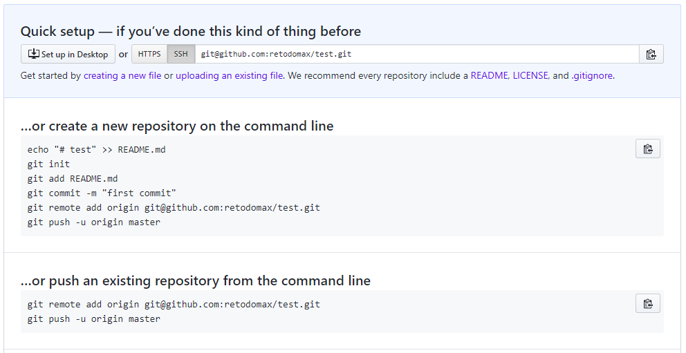

# Git Version control


## Git basics

Two very good intros:

- [Happy git with R](https://happygitwithr.com/)
- [Pro Git](https://git-scm.com/book/en/v2) or [1st edition in german](https://git-scm.com/book/de/v1)

Download Git: [here](https://git-scm.com/downloads)

Recommended: do your first steps with a Git client (GUI) to get a feeling for the workflow. Good clients are [SourceTree](https://www.sourcetreeapp.com/), [GitKraken](https://www.gitkraken.com/) but there are many more [here](https://git-scm.com/downloads/guis)

**Important bash commands**

* `cd` change directory
* `ls` list all files within directory
* `head` show head of file
* `rm` remove file

**Set global config variables**

``` bash
git config --global user.name 'Reto Zihlmann'
git config --global user.email 'retozihlmann@outlook.com'
git config --global --list
```
- user.email should be the same as used for your server (otherwise your commits appear as if they were done by someone else)
    - for GitHub: user.name 'retodomax', user.email 'retozihlmann@outlook.com'
    - for GitLab: user.name 'retoz', user.email 'retoz@student.ethz.ch'
- config file is normally located in your `HOME` directory `~`
- in Windows `~` often corresponds to `C:\Users\Reto`


**Clone repo to your local computer**

``` bash
git clone https://github.com/retodomax/YOUR-REPOSITORY.git
```

**Conect with remote respository**
```{r, out.width='100%', fig.align='center', fig.cap='...', echo = F}

```


**Show origin variable**

``` bash
git remote show origin
```

or shorter

``` bash
git remote -v
```

**list existing keys**
``` bash
ls -al ~/.ssh/
```


** generate new key**

```bash
ssh-keygen -t rsa -b 4096 -C "retozihlmann@outlook.com Lenovo"
```

- text at end of command should be something to recognize a computer
- only generate new keys if you have non
- find them in `~/.ssh`
- keygen will open dialog (always leave empty and press enter)
- after you generated your keys they have to be added to the **ssh-agent** and to the server

Check if agent is running

``` bash
eval $(ssh-agent -s)
```

Add keys to agent

``` bash
ssh-add ~/.ssh/id_rsa
```

Add keys to server

[github.com](www.github.com) -> Settings -> SSH


## Single user

### Regular workflow

1. Make new project in RStudio (tick "Create a git repository")
2. Make first commit (impossible to push empty git file)
3. Go to Server (e.g. [github.com](www.github.com)) and create new respository (Do not add README)
4. copy two git commands for pushing existing respository
  - use https or ssh link

``` bash
git remote add origin https://github.com/retodomax/My_project.git
git push -u origin master
```
5. paste commands in in Git Bash opend in the project folder
    - Attention: You can also use the RStudio Shell BUT it often does not find the right path to the keys (for ssh).

### Troubleshooting

* `git@github.com: Permission denied (pulickey)`: Are correct public keys registered on server website
* `fatal: remote origin already exists.`: there is already an "old" origin defined, which first needs to be removed. Use `git remote rm origin`
* `Could not create directory '/c/Users/Reto/OneDrive - ETHZ/Dokumente/.../repo/=/.ssh'`: RStudio shell has some problems in finding the HOME path to your keys. Use Git Bash instead to type in the command.


## Multiple users

### get foreign respository (fork)


1. Make folder where you want working directory
2. Right click and open: "Git bash here"
3. `git clone LINK`
    - --LINK can be found at "Clone or download" button of the github project (e.g. https://github.com/Stanimir-Ivanov/stats-lab.git)


