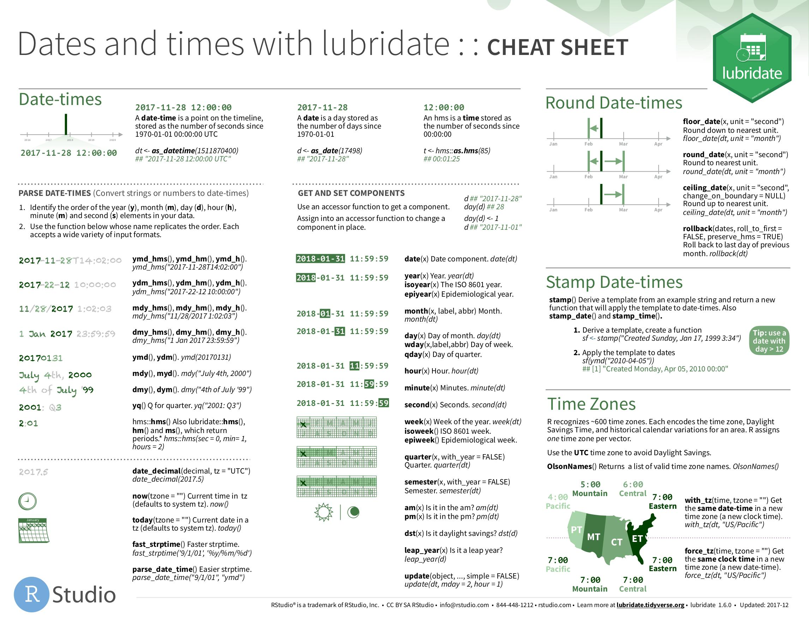

# R Markdown

## Components

* Three basic components of an R Markdown document
    - Metadata (YAML frontmatter)
    - Text (Markdown)
    - Code (R, Python, C++, ...)


### YAML frontmatter
The information of the YAML frontmatter is passed to the output function when the document is rendered. To see **all possible options** go to the help page of the output function (e.g. `?rmarkdown::html_document` or `?bookdown::gitbook`). Some options are passed to kniter and some are passed to pandoc.

All output functions:

`r knitr::combine_words(grep('^[^_]+_(document|presentation)$', ls(asNamespace('rmarkdown')), value = TRUE), sep = '\n', and = '', before = '- \x60', after = '\x60')`

And some of extension packages (you need to include the package name) e.g. `tufte::tufte_html`


The YAML frontmatter follows the a certain syntax

- starts and ends with three dashes `---`
- tag and value sparated by `:`
- `true`, `false` (unlike `TRUE`, `FALSE` in R)
- vectors: with square brackets e.g. `output: ["html_document", "word_document"]`
- lists: indet code by two spaces

### Text
The syntax for text (also known as prose or narratives) is Markdown. Markdown is a simple formatting syntax for authoring HTML, PDF, and MS Word documents.

Find all formatting syntax in detail in the [Pandoc Manual](https://pandoc.org/MANUAL.html#pandocs-markdown) e.g. 

* [Inline formatting](https://pandoc.org/MANUAL.html#inline-formatting)
* [Links](https://pandoc.org/MANUAL.html#links-1)
* [Lists](https://pandoc.org/MANUAL.html#lists)
* [Tables](https://pandoc.org/MANUAL.html#tables)

or in less detail in the [R Markdown manual](https://bookdown.org/yihui/rmarkdown/markdown-syntax.html)

* \\ : escape
* \` : code
* \* : italic/bold
* \_ : italic/bold
* \^ : superscript
* \~ : subscript
* \$ : formula
* \@ : reference
* \# : header
* \-/\+ : itemize
* \> : blockquote


```{r echo = FALSE, out.width='70%', fig.align = 'center'}
knitr::include_graphics("figures/writing_markdown.png")
```


### Code

#### Types
Two types of code

- A code chunk\index{code chunk} starts with three backticks like ```` ```{r} ```` where `r` indicates the language name, and ends with three backticks. You can write chunk options in the curly braces (e.g., set the figure height to 5 inches: ```` ```{r, fig.height=5} ````).
- An inline R code expression starts with `` `r `` and ends with a backtick `` ` ``.

#### Chunck Ouput

* Text
* Tables
* Graphics

#### Chunck options

All chunk options can be found in the [Knitr Manual](https://yihui.name/knitr/options/)

Most important chunck options:

- first element gives the engine (name of the language)
- second element can be a chunck name e.g. `{r, my-name, eval = ...}`
- `eval`: Whether to evaluate a code chunk.
- `echo`: Whether to echo the source code in the output document.
- `results`: When set to `'hide'`, text output will be hidden; when set to `'asis'`, text output is written "as-is", e.g., you can write out raw Markdown text from R code (like `cat('**Markdown** is cool.\n')`).
- `collapse`: Whether to merge text output and source code into a single code block in the output.
- `warning`, `message`, and `error`: Whether to show warnings, messages, and errors in the output document.
- `include`: Whether to include anything from a code chunk in the output document.
- `cache`: Whether to enable caching.
- `fig.width` and `fig.height` (or `fig.dim`): The (graphical device) size of R plots in **inches**.
- `out.width` and `out.height`: The output size of R plots in the output document in **percentage** (e.g. `out.width = '80%'`).
- `fig.align`: The alignment of plots. It can be `'left'`, `'center'`, or `'right'`.
- `dev`: The graphical device to record R plots. Typically it is `'pdf'` for LaTeX output, and `'png'` for HTML output, but you can certainly use other devices, such as `'svg'` or `'jpeg'`.
- `fig.cap`: The figure caption.
- `child`: You can include a child document in the main document. This option takes a path to an external file.


Set chunk option globally:


````markdown
`r ''````{r, setup, include=FALSE}
knitr::opts_chunk$set(comment = "##",
                      tidy = FALSE,
                      fig.align = "center",
                      out.width = "50%",
                      fig.width = 7,
                      fig.height = 5,
                      echo = TRUE,
                      warning = FALSE,
                      message = FALSE,
                      error = FALSE)
```
````

<!-- 
## this seems necessary for correct source code displaying...
``` --> 


## Figures

Plot from code chunks or insert via `knitr::include_graphics()`

e.g.

````markdown
`r ''````{r, echo = FALSE, out.width='25%', fig.align='center', fig.cap='...'}
knitr::include_graphics('figures/hex-rmarkdown.png')
```
````
<!-- 
## this seems necessary for correct source code displaying...
``` --> 

```{r include-graphics, echo=FALSE, fig.cap='The R Markdown hex logo.', out.width='25%', fig.align='center'}
knitr::include_graphics('figures/hex-rmarkdown.png')
```

Chunk options

* `fig.cap = "text"` Figure captation text or text reference
* `out.width < '50%', fig.show='hold', fig.align='default'` Show figures next to each other
    - Possible Bug: figures often are on top of each other
    - Always include `fig.align='default'` and it should work

Recomended file formate

* If output pdf use pdf images ([svg not possible](https://stackoverflow.com/questions/50165404/how-to-make-a-pdf-using-bookdown-including-svg-images)!)
* If output html use png images
* If output both use png
    - `options(knitr.graphics.auto_pdf = TRUE)` pdf output will automatically take file with same name but pdf format if it is available.


##### Wrap text arround plot {-}

Plots can be placed on right side with text wraped arround it. Use the following chunk options:

````markdown
`r ''````{r, out.width='25%', echo = FALSE, out.extra='style="float:right; padding:5px"'}
knitr::include_graphics('figures/hex-rmarkdown.png')
```
````
<!-- 
## this seems necessary for correct source code displaying...
``` --> 


##### Include figure which serves as a link {-}

````markdown
<a href="figures/03_pdf/lubridate.pdf" target="_blank"> 
`r ''````{r, echo=FALSE, out.width='50%'}

```
</a>
````
<!-- 
## this seems necessary for correct source code displaying...
``` --> 

`target="_blank"` makes sure that the browser opens the pdf in a new tab. To include a pdf without figure, just replace the R chunk part with some words.


## Tables

* For data in R use `knitr::kable()` (See [Kable Manual](https://cran.r-project.org/web/packages/kableExtra/vignettes/awesome_table_in_html.html))
* For text use [Pandoc tables](https://pandoc.org/MANUAL.html#tables)
    + Available
        - Simple tables
        - Multiline tables
        - Grid tables
        - Pipe tables
    + Recommended to use
        - pipe tables for simple tables (generate [here](https://www.tablesgenerator.com/markdown_tables))
        - Grid tables where you need bullet points within the table (generate [here](https://www.tablesgenerator.com/text_tables))


```{block2, type='rmdcaution'}
Without using a header, the formated table is reduced to an unformatted html table. Avoid this by including a white space into the header ()
```


### HTML tables

Tables can be formatted in CSS if we are only interested in HTML output. Add the following internal `<style>` element (in document between `<style>` and `</style>` tag) or use an external CSS file (`style.css`).

##### Definition tables {-}

```css
/* definition tables (RZ) */
.book .book-body .page-wrapper .page-inner section.normal .deftab td,
.book .book-body .page-wrapper .page-inner section.normal .deftab th,
.book .book-body .page-wrapper .page-inner section.normal .deftab tr
{
  padding:0;
  border-style: hidden;
  background-color: white;
}

.deftab th, .deftab td {
  vertical-align: top;
  text-align: left;
}
.deftab th {
  width: 20%;       /* header cells are 20% width (first column) */
}
.deftab td:nth-child(1) {
  width: 20%;       /* first td cell also 20% width (first column) */
}
```

Afterwards we can use HTML tags to create the table

```html
<table class = "deftab">
  <tr>
    <td>**Doe**</td>
    <td>John</td>
  </tr>
  <tr>
    <td>Doe</td>
    <td>John</td>
  </tr>
  <tr>
    <td>Doe</td>
    <td>John</td>
  </tr>
</table>
```

Results in 

<table class = "deftab">
  <tr>
    <td>**Doe**</td>
    <td>John</td>
  </tr>
  <tr>
    <td>Doe</td>
    <td>John</td>
  </tr>
  <tr>
    <td>Doe</td>
    <td>John</td>
  </tr>
</table>

## Math

New math commands can be included via Latex for pdf or [Mathjax](https://www.mathjax.org/) for html.

See this [StackOverflow post](https://stackoverflow.com/questions/33226675/how-to-get-bm-to-work-in-an-r-markdown-to-html-file/33248213#33248213) on how to include a Mathjax preamble


## Special characters

* Mathematical stuff with Latex
    - $\alpha$ $\Gamma$ $\ggg$ $\notin$ $\dagger$ $\mathbb{R}$ $\Rightarrow$ $\infty$ $n$
* What you can reach on the keyboard, use keyboard
    - §°+"ç%&/()=?¦¬|¢~[]èéàüöä<$£
* Some characters with special meaning in markdown needs to be escaped with \\
    - Everywhere \\ \` \* \_ \^ \~ \$ \@ \{ \}
    - Beginning of new line \# \- \+ \>
* Furter characters
    - Find symbol with google, copy-paste (e.g. €)
    - Find html code (e.g. \&euro; $\Rightarrow$ &euro;)
        + Find many [here](https://dev.w3.org/html5/html-author/charref)
* html code examples examples
    - \&nbsp; for non-breaking space (several after each other possible)
    - \&Tab; for a tab
    - \&#128512; for &#128512;
    - \&larr; for &larr; (does work in pdf)
    - \&rArr; for &rArr; (does not work in pdf)
    - Will not always work with pdf output (some characters work others not)!
* Text writing symbols
    - "\\  " backslash followed by space = nonbreaking space
    - backslash followed by newline = hard line break
    -"&#8239;" thin nonbreaking space
    -"&#8209;" nonbreaking hythen (should be used as hythen minus)


## Section folding

Section folding is only available for HTML documents. There are two good options

* Global code folding
* Local section folding


##### Global code folding {-}

Well explained [here](https://bookdown.org/yihui/rmarkdown/html-document.html#code-folding). Put the line `code_folding: hide` in the YAML header

```yaml
---
title: "My Document"
output:
  html_document:
    code_folding: hide
---
```

You can specify `code_folding: show` to still show all R code by default but then allow users to hide the code if they wish.


##### Local section folding {-}

Good ideas can be found [here](https://stackoverflow.com/questions/52576626/rmarkdown-collapsible-panel). Here we describe a methode with HTML/CSS buttons.

1. Add HTML code for button at beginning of your document. Alternatively you make a separate html file. Find button code and how to make separate HTML file in Chapter \@ref(NewBookdownProject)
2. Add this HTML code at the place were you want the button.

```html
<button onclick="myFunction('new_identifier')">Text on button</button>
<div id="new_identifier" style="display: none">

Blabla.

</div>
```

Replace `new_identifier` with unique identifier for that section. Replace `Text on button` and `Blabla`


## Add box

These type of boxes are only available for HTML documents.
There is a good implementation to add boxes for caution, important, note, tip and waring

1. Add CSS code for button at beginning of your document. Alternatively you make a separate CSS style file. Find button code and how to make separate CSS style file in Chapter \@ref(NewBookdownProject)
2. Add this code at the place were you want the button.


````markdown
`r ''````{block2, type='rmdcaution'}
Text
```
````

Replace `rmdcaution` with `rmdimportant`, `rmdnote`, `rmdtip` and `rmdwarning`. Note that the code chunk always needs to be taged as `block2`.

Here how they look like

```{block2, type='rmdcaution'}
Caution
```

```{block2, type='rmdimportant'}
Important
```

```{block2, type='rmdnote'}
Note
```

```{block2, type='rmdtip'}
Tip
```

```{block2, type='rmdwarning'}
Warning
```


## Template

This is a template containing structure, equations, references, cross-references, figures and tables with caption. The rendered output of the template can be found [here](https://retodomax.github.io/R_Ref_Book/template.html).
To get the the template in pdf, replace the `output` section in the YAML header with

```yaml
output:
    bookdown::pdf_document2:
      includes:
          in_header:
            - /home/reto/texmf-local/tex/latex/commonstuff/RetoArticle.sty
            - /home/reto/texmf-local/tex/latex/commonstuff/RetoMath.sty
classoption: a4paper
geometry: margin=2.5cm
```

A shorted template is available as code snipped "html" and "pdf".


<button onclick="myFunction('markdown_template')">Show template</button>

<div id="markdown_template" style="display: none">
````markdown
---
project: MyProj    #################################################
title:   Template
author:  "[Reto Zihlmann](https://retodomax.github.io/)"
date:    "`r '\x60r Sys.Date()\x60'`"
output:
  bookdown::html_document2:
    toc: true
    toc_float: true
bibliography:
  - "`r system('kpsewhich bib.bib', intern=TRUE)`"
  - bib_packages.bib
link-citations: true
---

`r ''````{r, setup, include=FALSE}
knitr::opts_chunk$set(comment = "",
                      tidy = TRUE,
                      fig.align = "left",
                      out.width = "100%",
                      echo = FALSE,
                      warning = FALSE,
                      message = FALSE,
                      error = FALSE)
```

`r ''````{r, package-bib, include=FALSE}
# automatically create a bib database for R packages
knitr::write_bib(c(
  .packages(), 'bookdown', 'knitr', 'rmarkdown', "mgcv"
), 'bib_packages.bib')
```


<!-- CSS Stype for Figure caption -->
<!-- CSS Style for more space between headers -->
<style>
caption {
  color: gray;
  font-size: 0.8em;
}
p.caption {
  color: gray;
  font-size: 0.8em;
  padding-bottom: 30px;
}
h1, .h1 {
    margin-top: 84px;
}
h2, .h2, h3, .h3 {
    margin-top: 42px;
}
</style>


# Abstract {-}

Here is some small abstract. Lorem ipsum dolor sit amet, consectetur adipiscing elit, sed do eiusmod tempor incididunt ut labore et dolore magna aliqua. Ut enim ad minim veniam, quis nostrud exercitation ullamco laboris nisi ut aliquip ex ea commodo consequat. Duis aute irure dolor in reprehenderit in voluptate velit esse cillum dolore eu fugiat nulla pariatur. Excepteur sint occaecat cupidatat non proident, sunt in culpa qui officia deserunt mollit anim id est laborum.


# Introduction {#intro}

Lorem ipsum dolor sit amet, consectetur adipiscing elit, sed do eiusmod tempor incididunt ut labore et dolore magna aliqua. Ut enim ad minim veniam, quis nostrud exercitation ullamco laboris nisi ut aliquip ex ea commodo consequat. Duis aute irure dolor in reprehenderit in voluptate velit esse cillum dolore eu fugiat nulla pariatur. Excepteur sint occaecat cupidatat non proident, sunt in culpa qui officia deserunt mollit anim id est laborum.

1. What is the first research question?
2. How should we answer it?
3. What is the third research question?


# Method {#method}

## Idea {#idea}

Lorem ipsum dolor sit amet, consectetur adipiscing elit (see [here](https://www.google.ch/)), sed do eiusmod tempor incididunt ut labore et dolore magna aliqua. Ut enim ad minim veniam, quis nostrud exercitation ullamco laboris nisi ut aliquip ex ea commodo consequat. Duis aute irure dolor in reprehenderit in voluptate velit esse cillum dolore eu fugiat nulla pariatur. Some inline equation $h = f(x)$ in the middle of text. Excepteur sint occaecat cupidatat non proident, sunt in culpa qui officia deserunt mollit anim id est laborum.

$$
a^2 + b^2 = c^2
(\#eq:pythagoras)
$$

As you can see in Equation \@ref(eq:pythagoras), lorem ipsum dolor sit amet, consectetur adipiscing elit, sed do eiusmod tempor incididunt ut labore et dolore magna aliqua. Ut enim ad minim veniam, quis nostrud exercitation ullamco laboris nisi ut aliquip ex ea commodo consequat. Duis aute irure dolor in reprehenderit in voluptate velit esse cillum dolore eu fugiat nulla pariatur. Excepteur sint occaecat cupidatat non proident, sunt in culpa qui officia deserunt mollit anim id est laborum.


`r ''````{r, someCalculations, echo = T}
x <- 5.012345678901234567890
y <- 1:20
```


In this text we use the variable $x$ and write it `r format(x, digits=4)` inline in text. Now a picture


(ref:resPr3) This is the figure caption. We can use it to explain the content of the figure. We can use it to explain the content of the figure. We can use it to explain the content of the figure. We can use it to explain the content of the figure.

## Calcultion {#calc}

`r ''````{r, figPoints, fig.cap="(ref:resPr3)"}
plot(1:10)
```


Now we continue with some text. As you can see in Figure \@ref(fig:figPoints) there are 10 points. The same was also decribed in Section \@ref(intro) or in Equation \@ref(eq:pythagoras) or in the package `rmarkdown` [see @R-bookdown]. The second way to make References [@R-mgcv]. For the third way see @R-knitr.


# Discussion {#disc}

Lorem ipsum dolor sit amet, consectetur adipiscing elit, sed do eiusmod tempor incididunt ut labore et dolore magna aliqua. Ut enim ad minim veniam, quis nostrud exercitation ullamco laboris nisi ut aliquip ex ea commodo consequat. Duis aute irure dolor in reprehenderit in voluptate velit esse cillum dolore eu fugiat nulla pariatur. Excepteur sint occaecat cupidatat non proident, sunt in culpa qui officia deserunt mollit anim id est laborum.

Lorem ipsum dolor sit amet, consectetur adipiscing elit, sed do eiusmod tempor incididunt ut labore et dolore magna aliqua. Ut enim ad minim veniam, quis nostrud exercitation ullamco laboris nisi ut aliquip ex ea commodo consequat. Duis aute irure dolor in reprehenderit in voluptate velit esse cillum dolore eu fugiat nulla pariatur. Excepteur sint occaecat cupidatat non proident, sunt in culpa qui officia deserunt mollit anim id est laborum.

`r ''````{r}
library(magrittr)
library(kableExtra)
dt <- mtcars[1:5, 1:6]
kable(dt,
      digits = 3,
      caption = "Estimated motor current and standard deviation for each impeller at the two operating points") %>%
  kable_styling("striped",
                full_width = F,
                position = "left") %>%
  add_header_above(c(" " = 1, "Group 1" = 2, "Group 2" = 2, "Group 3" = 2))
```


# References {#ref}
````

</div>


Good resources for additional tips/templates

* <https://holtzy.github.io/Pimp-my-rmd/> (Tips)
* <https://github.com/juba/rmdformats> (Templates package)


## Good output formats

* lightweight: `rmarkdown::html_vignette`
    - Details see [here](https://bookdown.org/yihui/rmarkdown/r-package-vignette.html)
* full-featured: `bookdown::gitbook`
    - Option `split_by: none` allows to get one long page
    - Option `self_containd: true` allows that all css and figure are included in html output file
* classic: `bookdown::html_document2`

Options

```yaml
title:   Test
author:  "[Reto Zihlmann](https://retodomax.github.io/)"
date:    "2020-11-09"
output:
  bookdown::gitbook:
    split_by: none
    self_contained: true
```

```{block2, type='rmdwarning'}
gitbook with option `self_containd: true` does currently not work with MathJax (Math not correcly displayed). For updates on this issue see [here](https://stackoverflow.com/questions/64760552/how-to-have-correctly-rendered-mathematical-equations-in-bookdowngitbook-when), [here](https://github.com/rstudio/bookdown/issues/915) and [here](https://github.com/rstudio/rmarkdown/issues/727).
```

