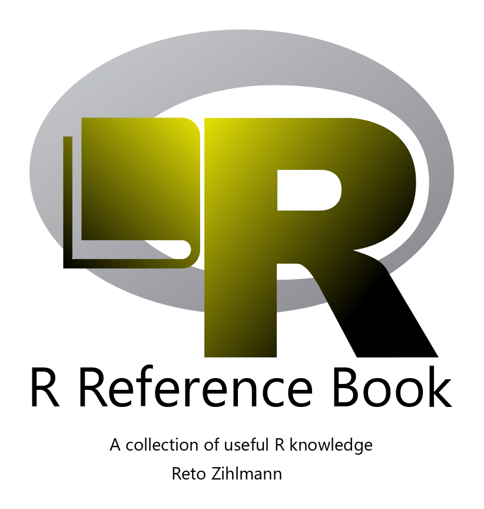

--- 
title: "R Reference book"
author: "Reto Zihlmann"
date: "`r Sys.Date()`"
site: bookdown::bookdown_site
documentclass: book
bibliography: [zotero_lib.bib, packages.bib]
biblio-style: apalike
link-citations: yes
github-repo: "retodomax/R_Ref_Book"
description: "This is a collection of useful R knowledge"
cover-image: "figures/01_cover/Cover.svg"
favicon: "figures/00_icon/icon2.ico"
---


# Introduction {-}

```{r, setup, include=FALSE}
knitr::opts_chunk$set(comment = "#>",
                      tidy = TRUE,
                      fig.align = "center",
                      out.width = "80%")
```


```{r echo = FALSE, out.width='70%', fig.align = 'center'}

```


***

This book contains a not final and constantely growing collection of useful R knowledge. [R](https://www.r-project.org/) is a free software environment for statistical computing and graphics. 
The book is written in [RMarkdown](https://rmarkdown.rstudio.com/) with [bookdown](https://bookdown.org/).


***

<a rel="license" href="http://creativecommons.org/licenses/by-nc-sa/4.0/"></a><br />This work is licensed under a <a rel="license" href="http://creativecommons.org/licenses/by-nc-sa/4.0/">Creative Commons Attribution-NonCommercial-ShareAlike 4.0 International License</a>.


***

```{r include=FALSE}
# automatically create a bib database for R packages
knitr::write_bib(c(
  .packages(), 'bookdown', 'knitr', 'rmarkdown'
), 'packages.bib')
```
